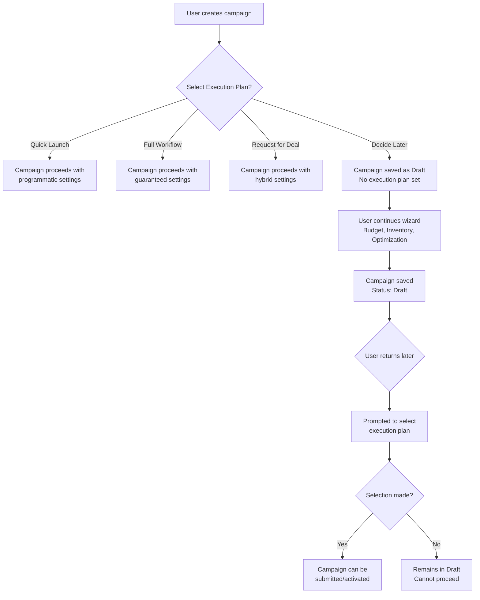

# Product Backlog

This document tracks features, enhancements, and fixes that have been identified during documentation and development but are not yet implemented.

---

## High Priority

### 1. Custom Date Range Configuration

**Identified during:** Campaign Creation Guide documentation  
**Date added:** November 2025  
**Status:** Not implemented

#### Current State
The campaign creation page shows fixed quick selection options:
- Next 7 days
- Next 30 days
- Next 45 days
- Next 60 days

These options are hardcoded and cannot be changed by users.

#### Requested Feature
Users should be able to customize the quick selection options in the Configuration page to match their typical campaign planning cycles.

#### Use Cases

**Use Case 1: Short-Term Campaign Planner**
A retail media owner runs frequent flash sales and promotional campaigns. They typically plan campaigns 3-5 days in advance and rarely more than 2 weeks out. They would prefer quick options like:
- Next 3 days
- Next 5 days
- Next 10 days
- Next 14 days

**Use Case 2: Long-Term Strategic Planner**
An agency that handles annual contracts for major brands plans campaigns months in advance. They would benefit from options like:
- Next 30 days
- Next 60 days
- Next 90 days
- Next 180 days

**Use Case 3: Standard Weekly Planner**
A company that aligns campaigns with weekly reporting cycles would prefer:
- Next 7 days (1 week)
- Next 14 days (2 weeks)
- Next 28 days (4 weeks)
- Next 35 days (5 weeks)

#### Implementation Notes

1. **Database Schema**
   - Add a new table or field in company/user settings to store custom date presets
   - Structure: Array of objects with `{ label: string, days: number }`
   - Allow 3-6 custom presets per account

2. **Configuration Page UI**
   - Add a new section "Campaign Date Presets" in the Configuration page
   - Allow users to add, edit, and remove presets
   - Provide validation (minimum 1 day, maximum 365 days)
   - Include a "Reset to Defaults" option

3. **Campaign Creation Integration**
   - Fetch user/company date presets when loading campaign creation page
   - Fall back to system defaults if no custom presets are configured
   - Display presets as quick selection buttons

4. **Scope**
   - Store preferences at company level (all users in the company share the same presets)
   - Internal/admin users should be able to set system-wide defaults

#### Acceptance Criteria
- [ ] User can access date preset configuration in Configuration page
- [ ] User can add, edit, and delete up to 6 custom date presets
- [ ] Changes are saved and persist across sessions
- [ ] Campaign creation page shows custom presets instead of defaults
- [ ] Validation prevents invalid values (0 days, negative numbers, >365 days)
- [ ] Reset to defaults functionality works correctly

---

### 2. DSP and Seat ID Verification

**Identified during:** Campaign Creation Guide documentation  
**Date added:** November 2025  
**Status:** Not implemented

#### Current State
When creating a brand, users can manually enter:
- DSP (Demand Side Platform) name
- Seat ID

However, there is no verification that the Seat ID is valid or active. Users can enter any text, and the system accepts it without validation.

#### Requested Feature
When a user provides a DSP and Seat ID during brand creation, the platform should verify that the Seat ID is valid and active with the specified DSP.

#### Why This Matters

**Impact of Invalid Seat IDs:**
- Programmatic campaigns may fail to execute if Seat ID is incorrect
- Deals created with invalid Seat IDs cannot be accepted by advertisers
- Time wasted troubleshooting issues that could have been prevented
- Poor user experience when campaigns fail after setup

**Benefits of Verification:**
- Immediate feedback during brand creation
- Prevent downstream campaign failures
- Build user confidence in the platform
- Reduce support tickets related to invalid programmatic setup

#### Implementation Notes

1. **Supported DSPs for Verification**
   - The Trade Desk (TTD)
   - Google Display & Video 360 (DV360)
   - Xandr (formerly AppNexus)
   - MediaMath
   - Amazon DSP
   
   Note: Each DSP has different API endpoints and authentication requirements.

2. **API Integration Requirements**
   - Research and document API access requirements for each DSP
   - Some DSPs may require partner-level credentials
   - Rate limiting considerations for verification calls
   - Caching strategy for repeated verifications

3. **User Experience Flow**
   ```
   User enters DSP and Seat ID
          ↓
   User clicks "Verify" or continues to save
          ↓
   System calls DSP API with Seat ID
          ↓
   ┌──────────────────────────────┐
   │     Verification Result      │
   ├──────────────────────────────┤
   │ ✓ Valid & Active            │ → Green checkmark, allow save
   │ ✗ Invalid Seat ID           │ → Red error, block save
   │ ⚠ Unable to verify          │ → Warning, allow save with disclaimer
   │ ⏳ Verification in progress │ → Loading spinner
   └──────────────────────────────┘
   ```

4. **Handling Edge Cases**
   - DSP not supported: Show warning, allow save with disclaimer
   - API temporarily unavailable: Show warning, allow save
   - Rate limit exceeded: Queue verification, notify user later
   - Partial verification: Some DSPs may only confirm format validity

5. **Data Storage**
   - Store verification status with brand record
   - Store last verification date
   - Consider periodic re-verification for existing brands

#### Downstream Impact of Verification

**If verification is NOT implemented (current state):**

```
Campaign Creation                  Campaign Execution
      │                                  │
      ▼                                  ▼
Brand created with           ┌─────────────────────────┐
invalid Seat ID              │ Programmatic deal fails │
      │                      │ to execute - invalid    │
      │                      │ Seat ID rejected by DSP │
      ▼                      └─────────────────────────┘
Quick Launch or                        │
Request for Deal                       ▼
selected                     ┌─────────────────────────┐
      │                      │ User troubleshoots for  │
      │                      │ hours, contacts support │
      ▼                      └─────────────────────────┘
Campaign submitted                     │
without error                          ▼
                             ┌─────────────────────────┐
                             │ Campaign delayed or     │
                             │ fails entirely          │
                             └─────────────────────────┘
```

**If verification IS implemented (target state):**

```
Campaign Creation                  Campaign Execution
      │                                  │
      ▼                                  ▼
Brand creation with          ┌─────────────────────────┐
Seat ID entered              │ Campaign executes       │
      │                      │ successfully - verified │
      ▼                      │ Seat ID works           │
Verification runs            └─────────────────────────┘
      │
  ┌───┴───┐
  │       │
  ▼       ▼
Valid   Invalid
  │       │
  ▼       ▼
Green   Error shown
check   immediately
  │       │
  ▼       ▼
Save    User fixes
brand   before saving
```

#### Brand Linkage Considerations

When a brand is created with DSP and Seat ID, the following linkages are established:

1. **Brand → DSP Platform**: The brand is associated with a specific DSP
2. **Brand → Seat**: The Seat ID links the brand to the advertiser's account in that DSP
3. **Campaign → Brand → Seat**: When campaigns use this brand, deals are sent to the correct Seat

Incorrect Seat IDs break this chain, causing deals to fail or be sent to wrong accounts.

#### Acceptance Criteria
- [ ] User can enter DSP selection from dropdown (supported DSPs)
- [ ] User can enter Seat ID as text input
- [ ] System attempts verification when user saves brand
- [ ] Valid Seat ID shows green confirmation with DSP name
- [ ] Invalid Seat ID shows clear error message with guidance (check for typos, verify with DSP)
- [ ] Unsupported DSP or unavailable API shows appropriate warning (allow save with disclaimer)
- [ ] Verification status is stored and displayed in brand details
- [ ] Verification timestamp stored for audit purposes
- [ ] Re-verification option available for previously verified Seat IDs
- [ ] Documentation provided for adding new DSP integrations

---

### 3. "Decide Later" Option for Execution Plan

**Identified during:** Campaign Creation Guide documentation  
**Date added:** November 2025  
**Status:** Not implemented

#### Current State
When creating a campaign, users must select an execution plan (Quick Launch, Full Workflow, or Request for Deal) before proceeding. There is no option to defer this decision.

#### Requested Feature
Add a "Decide Later" option that allows users to save their campaign as a draft without selecting an execution plan. This is useful when:
- Users are still exploring inventory options and haven't decided on execution method
- Users need to consult with team members before committing to an approach
- Users want to save progress and return later to finalize the campaign

#### User Experience

```
┌─────────────────────────────────────────────────────────────┐
│  Select an Execution Plan                                    │
├─────────────────────────────────────────────────────────────┤
│                                                              │
│  ┌─────────────────┐  ┌─────────────────┐                   │
│  │  Quick Launch   │  │  Full Workflow  │                   │
│  │  (Programmatic) │  │  (Guaranteed)   │                   │
│  └─────────────────┘  └─────────────────┘                   │
│                                                              │
│  ┌─────────────────┐  ┌─────────────────┐                   │
│  │ Request for Deal│  │  Decide Later   │  ← NEW OPTION     │
│  │  (Hybrid)       │  │  (Save as Draft)│                   │
│  └─────────────────┘  └─────────────────┘                   │
│                                                              │
└─────────────────────────────────────────────────────────────┘
```

#### Workflow Impact

**With "Decide Later" selected:**
1. Campaign is saved as Draft status
2. User can proceed through remaining wizard steps (Budget, Inventory, Optimization)
3. Campaign cannot be submitted/activated until execution plan is selected
4. When user returns to campaign, they are prompted to select execution plan
5. Execution plan can be selected from campaign detail page or by re-entering wizard



#### Implementation Notes

1. **UI Changes**
   - Add fourth option "Decide Later" to execution plan selection
   - Style as secondary/outlined to differentiate from primary options
   - Add explanatory text: "Save your campaign and choose an execution plan later"

2. **Data Model**
   - Allow `executionPlan` field to be null/undefined for draft campaigns
   - Add validation to prevent submission when executionPlan is not set

3. **Campaign Detail Page**
   - Show "Select Execution Plan" prompt for drafts without execution plan
   - Add button/link to open execution plan selection dialog
   - Display warning if user tries to activate without execution plan

4. **Wizard Behavior**
   - Allow wizard to proceed through all steps even with "Decide Later"
   - Final step should show reminder that execution plan is needed before activation

#### Acceptance Criteria
- [ ] "Decide Later" option visible in execution plan selection
- [ ] Campaign saves as Draft when "Decide Later" is selected
- [ ] User can proceed through all wizard steps without execution plan
- [ ] Campaign detail page shows prompt to select execution plan for incomplete drafts
- [ ] Campaign cannot be submitted/activated until execution plan is selected
- [ ] User can select execution plan from campaign detail page
- [ ] Selecting execution plan updates campaign and enables submission

---

## Medium Priority

### 4. Agency Creation Permission Control for Agency Users

**Identified during:** Campaign Creation Guide documentation  
**Date added:** November 2025  
**Status:** Partially implemented

#### Current State
The documentation indicates that agency users should only be able to create new agencies if this permission is enabled for them in Account Management. The current implementation may not fully enforce this restriction.

#### Requested Feature
Implement proper permission checking for agency users attempting to create new agencies:
- Check Account Management for the user's agency creation permission
- If enabled: Show "Create New Agency" option, create as child account
- If disabled: Hide "Create New Agency" option entirely

#### Impact of Agency Creation

When an agency is created, multiple downstream effects occur:

**Immediate Effects:**
1. Agency record created in Account Management (accounts.movingwalls.com)
2. Entry added to Company table for sales team visibility
3. Mapping created between creator and new agency
4. MW sales team receives notification for follow-up

**Parent vs Child Account Impact:**

| Aspect | Parent Account | Child Account |
|--------|---------------|---------------|
| Created by | Media Owner, Internal, Partner | Agency User (if permitted) |
| Organizational hierarchy | Independent top-level | Reports to parent agency |
| Billing | Separate billing entity | May share parent's billing |
| User management | Own user base | May inherit from parent |
| Campaign visibility | Own campaigns only | May see parent's campaigns |
| MW sales follow-up | Priority onboarding | May be handled by parent |

**Long-term Effects:**
- Agency appears in dropdown lists for all users who map to it
- Campaigns can be created for this agency
- Business relationships tracked across the platform
- Reporting and analytics include this agency

#### Implementation Notes

1. **Permission Check**
   - Add API endpoint or modify existing to check user permissions from Account Management
   - Permission name: "Allow Child Agency Creation" (allowChildAgencyCreation)
   - Permission should be set per-user or per-company in Account Management

2. **UI Changes**
   - Conditionally show/hide "Create New Agency" button based on permission
   - If hidden, no messaging needed (clean UI)
   - Could add tooltip explaining why option is not available

3. **Backend Validation**
   - Even if UI is bypassed, backend must validate permission
   - Return appropriate error if user lacks permission
   - Log unauthorized attempts for security audit

4. **Parent-Child Relationship**
   - When agency user creates agency, automatically set parent_company_id
   - Ensure child agency inherits appropriate settings from parent
   - Send notification to parent agency admin

#### Acceptance Criteria
- [ ] Agency users without permission cannot see "Create New Agency" option
- [ ] Agency users with permission can create agencies as child accounts
- [ ] Child agency is properly linked to parent agency
- [ ] Backend validates permission before creating agency
- [ ] Error message shown if permission check fails
- [ ] Parent agency admin notified of new child agency creation
- [ ] Audit log entry created for agency creation

---

### 5. Brand Creation - Additional Fields (DSP, Seat ID UI)

**Identified during:** Campaign Creation Guide documentation  
**Date added:** November 2025  
**Status:** UI not implemented, fields defined

#### Current State
The brand creation panel currently collects:
- Brand Name (required)
- IAB Category (required)
- Website (optional)
- Logo (optional)

The documentation mentions DSP and Seat ID as additional optional fields, but these are not currently present in the brand creation UI (brand-creator-panel.tsx).

#### Requested Feature
Add DSP and Seat ID fields to the brand creation panel to enable programmatic campaign setup.

#### Impact of Brand Creation

When a brand is created, the following effects occur:

**Immediate Effects:**
1. Brand record created in Account Management master list
2. Brand mapped to creator's account (appears in their dropdown)
3. Brand becomes searchable by all platform users

**With DSP and Seat ID (target state):**
1. Brand linked to specific DSP platform
2. Programmatic deals can be executed to correct Seat
3. Quick Launch and Request for Deal campaigns work seamlessly
4. No manual Seat ID entry needed at campaign level

**Without DSP and Seat ID (current state):**
1. Programmatic campaigns require manual Seat ID entry
2. Risk of incorrect Seat ID causing deal failures
3. Additional configuration needed per campaign
4. User must know their Seat ID (may not have it readily available)

**Brand Usage Across Campaigns:**

```
Brand: "Nike" (with DSP: TTD, Seat: ABC123)
         │
         ├── Campaign 1: "Nike Summer Sale"
         │   └── Uses Brand's Seat ID automatically
         │
         ├── Campaign 2: "Nike Back to School"
         │   └── Uses Brand's Seat ID automatically
         │
         └── Campaign 3: "Nike Holiday"
             └── Uses Brand's Seat ID automatically

Result: Consistent programmatic execution across all campaigns
```

#### Implementation Notes

1. **DSP Field**
   - Dropdown/searchable select
   - Options: The Trade Desk, DV360, Xandr, MediaMath, Amazon DSP, Other
   - Optional field

2. **Seat ID Field**
   - Text input
   - Only show/enable when DSP is selected
   - Optional but recommended if DSP is selected
   - Add verification once item #2 (DSP Verification) is complete

3. **UI Placement**
   - Add after IAB Category field
   - Collapsible "Programmatic Settings" section (advanced)
   - Or inline with other optional fields

4. **Data Flow**
   - Store DSP and Seat ID with brand record in Account Management
   - Planner fetches these when brand is selected for campaign
   - Campaign inherits DSP/Seat from brand (can be overridden)

#### Acceptance Criteria
- [ ] DSP dropdown added to brand creation form
- [ ] Seat ID text field added (visible when DSP selected)
- [ ] Both fields are optional
- [ ] Values saved correctly to brand record in Account Management
- [ ] Fields displayed in brand detail view
- [ ] Campaigns inherit DSP/Seat from selected brand
- [ ] Override option available at campaign level if needed

---

### 6. Dynamic Country Filtering Based on User Role

**Identified during:** Campaign Creation Guide documentation (Step 2)  
**Date added:** November 2025  
**Status:** Not implemented

#### Current State
The country dropdown in Step 2 (Budget & Location) displays a fixed list of supported countries (Malaysia, United States, United Kingdom, Singapore, Australia). All users see the same country options regardless of their role or company setup.

#### Requested Feature
Implement role-based country filtering:
- **Media Owners**: Show only countries where they have registered inventories
- **Agencies/Advertisers**: Show countries enabled for them in Account Management
- **Internal/Partners**: Show all supported countries

#### Implementation Notes

1. **For Media Owners**
   - Query Planner database for distinct countries in inventories table where mediaOwnerId matches
   - Only include countries with at least 1 active inventory
   
2. **For Agencies/Advertisers**
   - Query Account Management API for user's enabled countries
   - Fall back to company's registered country if none enabled
   
3. **For Internal/Partners**
   - Return full list of supported countries

4. **Default Country**
   - Set default to company's registered country
   - If company country not in available list, default to first available

#### Acceptance Criteria
- [ ] Media Owners only see countries where they have inventory
- [ ] Agencies see countries enabled in Account Management
- [ ] Default country matches company registration
- [ ] API endpoint created for fetching available countries
- [ ] Frontend updated to use dynamic country list

---

### 7. Remove Attribution and Other from Campaign Goals

**Identified during:** Campaign Creation Guide documentation (Step 2)  
**Date added:** November 2025  
**Status:** Not implemented

#### Current State
The campaign goals dropdown currently includes five options:
1. Impressions ✓ (Keep)
2. Reach ✓ (Keep)
3. Share of Voice (SOV) ✓ (Keep)
4. Attribution ✗ (Remove)
5. Other ✗ (Remove)

#### Requested Change
Remove "Attribution" and "Other" from the campaign goals dropdown in the Budget & Location step (Step 2) of campaign creation.

#### Rationale
- **Attribution**: This goal type implies tracking conversions and actions, which requires additional measurement infrastructure not currently integrated with Planner's recommendation engine
- **Other**: A catch-all option that provides no guidance to the system and doesn't help with recommendations

The three remaining goals (Impressions, Reach, SOV) are the core OOH campaign objectives that the system can meaningfully optimize for.

#### Files to Modify
- `client/src/components/campaign-creation/budget-goal.tsx` - Remove entries from CAMPAIGN_GOALS array

#### Acceptance Criteria
- [ ] Attribution option removed from goal type dropdown
- [ ] Other option removed from goal type dropdown
- [ ] Only Impressions, Reach, and SOV remain as options
- [ ] Any existing campaigns with Attribution or Other goals continue to work (no data migration needed)
- [ ] Quick Tips only show for the three supported goals

---

### 8. Configurable Age Group Ranges

**Identified during:** Campaign Creation Guide documentation (Step 3)  
**Date added:** December 2025  
**Status:** Not implemented

#### Current State
Age groups in the targeting step are hardcoded with fixed ranges:
- 18-24, 25-34, 35-44, 45-54, 55-64, 65+

These values cannot be changed by users.

#### Requested Feature
Allow organizations to customize age group ranges through the Configuration page to match their market research methodology.

#### Use Cases

**Use Case 1: Youth-Focused Advertiser**
A company targeting younger demographics prefers:
- 10-17, 18-25, 26-35, 36-45, 46+

**Use Case 2: Fine-Grained Segmentation**
A research-driven agency uses 5-year increments:
- 18-22, 23-27, 28-32, 33-37, 38-42, etc.

**Use Case 3: Simplified Segmentation**
A small business prefers broader groups:
- Under 25, 25-50, Over 50

#### Implementation Notes

1. **Configuration Schema**
   - Add age_group_config to company/tenant settings
   - Structure: Array of `{ id: string, label: string, minAge: number, maxAge: number }`
   - Validate no overlapping ranges
   - Allow 3-10 custom groups

2. **Configuration Page UI**
   - Add "Age Group Ranges" section to Configuration page
   - Allow users to add, edit, and remove custom ranges
   - Provide validation (no gaps, no overlaps, min 0, max 100+)
   - Include "Reset to Defaults" option

3. **Targeting Integration**
   - Fetch company's age group config when loading targeting step
   - Fall back to system defaults if no custom config
   - Display custom ranges in the Age Groups selector

4. **Recommendation Engine**
   - Recommendation engine should use IDs, not specific ranges
   - Same targeting logic applies regardless of custom ranges

#### Acceptance Criteria
- [ ] Configuration page shows Age Group Ranges section
- [ ] User can add/edit/remove up to 10 custom age ranges
- [ ] Validation prevents overlapping or invalid ranges
- [ ] Targeting step displays custom age groups
- [ ] Recommendation engine continues to work with custom ranges
- [ ] Reset to defaults functionality works correctly

---

### 9. Country-Specific Income Bracket Ranges

**Identified during:** Campaign Creation Guide documentation (Step 3)  
**Date added:** December 2025  
**Status:** Not implemented

#### Current State
Income brackets show hardcoded ranges based on Malaysian Ringgit (MYR) values, regardless of the country selected in Step 2. This is misleading for campaigns in other countries.

#### Requested Feature
Display income ranges appropriate to the selected country's currency and economic context.

#### How It Should Work

The five income category labels remain constant:
- Low
- Lower-Middle
- Middle
- Upper-Middle
- High

But the monetary ranges change based on country:

| Category | Malaysia (MYR) | Singapore (SGD) | United States (USD) |
|----------|----------------|-----------------|---------------------|
| Low | < 128,000/year | < 30,000/year | < 35,000/year |
| Lower-Middle | 128,000 - 213,000 | 30,000 - 60,000 | 35,000 - 50,000 |
| Middle | 213,000 - 426,000 | 60,000 - 120,000 | 50,000 - 100,000 |
| Upper-Middle | 426,000 - 639,000 | 120,000 - 200,000 | 100,000 - 150,000 |
| High | > 639,000/year | > 200,000/year | > 150,000/year |

#### Implementation Notes

1. **Database Schema**
   - Add income_ranges table or configuration field
   - Structure: `{ country_code: string, ranges: { low: number, lowerMiddle: number, middle: number, upperMiddle: number, high: number } }`
   - Include currency code with each country

2. **Data Population**
   - Research and populate appropriate ranges for all supported countries
   - Use economic data sources (World Bank, national statistics)
   - Allow admin override in Configuration page

3. **API Changes**
   - Modify targeting API to accept country parameter
   - Return country-specific income ranges
   - Include currency code in response

4. **Frontend Changes**
   - Fetch income ranges when country is selected
   - Display ranges with appropriate currency code (MYR, SGD, USD)
   - Update range display when country changes

5. **Recommendation Engine Impact**
   - **IMPORTANT**: Recommendation engine only uses category labels (low, middle, high)
   - Monetary ranges are for user context only
   - No changes needed to recommendation algorithms

#### Acceptance Criteria
- [ ] Income ranges fetch dynamically based on selected country
- [ ] Ranges display with correct currency code (e.g., "< 35,000 USD/year")
- [ ] All supported countries have appropriate income ranges defined
- [ ] Configuration page allows admin to customize ranges per country
- [ ] Recommendation engine continues to work unchanged
- [ ] Tooltip explains that recommendations use category labels, not specific values

---

### 10. Geofencing CSV Import/Export

**Identified during:** Campaign Creation Guide documentation (Step 3)  
**Date added:** December 2025  
**Status:** Not implemented

#### Current State
Geographic targeting requires manual entry of each location through:
- Search bar
- Click on map
- Draw shapes

For campaigns with many targeting areas, this is time-consuming.

#### Requested Feature
Allow users to import and export geographic targets via CSV files.

#### Import Feature

Upload a CSV file to bulk-add targeting locations:

**CSV Format:**
```csv
latitude,longitude,radius,name
3.1390,101.6869,500,KLCC
3.1570,101.7120,1000,Ampang
1.2897,103.8501,750,Marina Bay
```

| Column | Required | Type | Description |
|--------|----------|------|-------------|
| latitude | Yes | Decimal | Latitude coordinate |
| longitude | Yes | Decimal | Longitude coordinate |
| radius | Yes | Integer | Radius in meters (100-50000) |
| name | No | String | Display name for the location |

**Import Behavior:**
- Each row creates a "proximity" type target
- Circles appear on map at specified coordinates
- Targets added to Selected Locations list
- Validation errors shown per-row (invalid coordinates, out-of-range radius)

#### Export Feature

Export all current geographic targets to CSV:
- City/region selections export with centroid coordinates
- Custom shapes export with center point and approximate radius
- POIs export with their coordinates

**Export Format:**
```csv
id,name,type,latitude,longitude,radius,included
loc-001,Kuala Lumpur,city,3.1390,101.6869,5000,true
loc-002,Custom Area,proximity,3.1570,101.7120,1000,true
```

#### Implementation Notes

1. **UI Components**
   - Add Import/Export buttons to geofencing tab toolbar
   - Import: File upload with drag-and-drop support
   - Export: Download button generating CSV

2. **Import Validation**
   - Validate latitude (-90 to 90) and longitude (-180 to 180)
   - Validate radius (minimum 100m, maximum 50000m)
   - Show validation summary before confirming import
   - Allow partial import (skip invalid rows)

3. **Integration**
   - Use papaparse for CSV parsing (already installed)
   - Update SimplifiedGeoTargeting component
   - Add targets to existing geofencing state

#### Acceptance Criteria
- [ ] Import button visible in geofencing tab
- [ ] CSV file upload with drag-and-drop support
- [ ] Validation of CSV format and values
- [ ] Imported locations appear on map and in list
- [ ] Export button visible in geofencing tab
- [ ] Export downloads all current targets as CSV
- [ ] Sample CSV file downloadable for reference

---

### 11. Google Places POI Search Integration

**Identified during:** Campaign Creation Guide documentation (Step 3)  
**Date added:** December 2025  
**Status:** Not implemented

#### Current State
Users can search for locations by name using Mapbox geocoding, but cannot:
- Search for specific types of businesses (restaurants, shopping malls)
- Find POIs within a drawn area
- See detailed information about points of interest

#### Requested Feature
Integrate Google Places API to enable POI discovery within geographic areas.

#### How It Should Work

1. **Trigger**: User searches for an area or draws a shape on the map
2. **Search**: System queries Google Places API for POIs in that area
3. **Results**: POI cards displayed with category, name, photo, and busyness
4. **Selection**: User clicks to add POIs to targeting list

#### POI Data Returned

| Field | Source | Description |
|-------|--------|-------------|
| Category | places.types | Google Places category (restaurant, shopping_mall, etc.) |
| Name | places.displayName | Business or place name |
| Photo | places.photos | Primary photo of the location |
| Busyness | places.regularOpeningHours + popular times | Typical foot traffic patterns |

#### Category Icon Mapping

Map Google Places types to display icons:

| Google Places Type | Display Icon | Category Label |
|--------------------|--------------|----------------|
| restaurant, cafe, food | 🍽️ | Food & Dining |
| shopping_mall, store, clothing_store | 🛍️ | Shopping |
| movie_theater, amusement_park | 🎬 | Entertainment |
| hospital, doctor, pharmacy | 🏥 | Health |
| bank, atm | 🏦 | Finance |
| school, university | 🎓 | Education |
| train_station, airport, bus_station | 🚉 | Transportation |
| lodging, hotel | 🏨 | Lodging |
| church, mosque, hindu_temple | ⛪ | Worship |
| gym, stadium | 🏋️ | Sports & Fitness |
| gas_station | ⛽ | Gas Station |
| parking | 🅿️ | Parking |

#### Implementation Notes

1. **API Setup**
   - Register for Google Places API
   - Store API key in secrets
   - Configure billing alerts (Places API has costs)

2. **Backend Integration**
   - Create /api/places/search endpoint
   - Accept bounds (lat/lng box) or polygon coordinates
   - Query Places API for POIs in area
   - Transform response to internal format

3. **Frontend Components**
   - Add "Find POIs" button to geofencing tab
   - POI result cards with photo, name, category, busyness
   - Click to add POI to targeting list
   - POI appears in Selected Locations with "poi" type

4. **Rate Limiting**
   - Implement debounce on searches
   - Cache results for same bounds
   - Show quota warnings if approaching limits

#### Acceptance Criteria
- [ ] "Find POIs" button visible after area selection
- [ ] POI search returns relevant businesses in area
- [ ] Results display with category icon, name, photo
- [ ] Busyness indicator shows when data available
- [ ] Click adds POI to targeting list
- [ ] POIs appear on map with category-specific markers
- [ ] Rate limiting prevents excessive API calls
- [ ] Error handling for API failures/quota exceeded

---

## Low Priority

### 12. Brand and Agency Impact Documentation in UI

**Identified during:** Campaign Creation Guide documentation  
**Date added:** November 2025  
**Status:** Not implemented

#### Requested Feature
Add contextual help/tooltips in the brand and agency creation forms explaining:
- Where the data is stored (Account Management)
- Who else can see/use the created entity
- How it affects other users and campaigns
- What the sales team follow-up process looks like

This would improve user understanding and reduce confusion about the multi-platform architecture.

---

## Completed

*(No items currently completed)*

---

## How to Use This Backlog

1. **Adding Items**: When identifying missing features during documentation or development, add them to this file with appropriate priority.

2. **Moving to Development**: When an item is selected for development, create appropriate tasks in the sprint plan and update the status here.

3. **Completion**: When implemented, move the item to the "Completed" section with the completion date.

4. **Review**: This backlog should be reviewed regularly to ensure priorities remain accurate.

---

*Last Updated: December 2025*
