# Campaign Creation Guide

## Introduction

Creating a campaign is the first step in planning your out-of-home (OOH) advertising journey. This guide walks you through the campaign creation process, explaining each step in detail. Whether you are a media owner managing billboard spaces, an agency planning campaigns for clients, or an advertiser looking to reach your audience, this guide will help you understand how the system works for your specific needs.

The campaign creation process is designed to be intuitive and efficient. As you move through each step, the system provides helpful tips and recommendations based on the information you provide. Think of it as having a knowledgeable assistant guiding you through the planning process.

---

## Understanding the Campaign Creation Flow

When you create a new campaign, the system takes you through a series of steps. Each step builds upon the previous one, collecting the information needed to plan and execute your advertising campaign successfully.

```
┌─────────────────────────────────────────────────────────────────────────────────┐
│                         CAMPAIGN CREATION FLOW                                   │
└─────────────────────────────────────────────────────────────────────────────────┘

     ┌──────────────────┐
     │  Step 1          │
     │  Campaign        │──────► You are here
     │  Details         │
     └────────┬─────────┘
              │
              ▼
     ┌──────────────────┐
     │  Step 2          │
     │  Budget &        │
     │  Location        │
     └────────┬─────────┘
              │
              ▼
     ┌──────────────────┐
     │  Step 3          │
     │  Targeting       │        (Optional)
     │                  │
     └────────┬─────────┘
              │
              ▼
     ┌──────────────────┐
     │  Step 4          │
     │  Inventories     │
     │                  │
     └────────┬─────────┘
              │
              ▼
     ┌──────────────────┐
     │  Step 5          │
     │  Optimization    │        (Optional)
     │                  │
     └────────┬─────────┘
              │
              ▼
     ┌──────────────────┐
     │  Step 6          │
     │  Review &        │
     │  Submit          │
     └──────────────────┘
```

The steps marked as "Optional" can be skipped if you prefer to use default settings. However, completing these steps helps the system provide better recommendations for your campaign.

---

## Where Your Data Lives: Understanding the Platform Architecture

Before diving into the details, it's important to understand that MW Planner works together with another platform called **Account Management**.

**Account Management** (accounts.movingwalls.com) is the central system that stores:
- All agency records
- All brand records
- Company information and relationships
- User accounts and permissions

**Planner** (planner.movingwalls.com) is the campaign planning system you are using. It does not store agencies or brands directly. Instead, it uses APIs (Application Programming Interfaces) to fetch and create records in Account Management.

This separation means that when you create a new agency or brand in Planner, the data actually gets stored in Account Management, making it available across all Moving Walls products and ensuring consistency.

---

## Step 1: Campaign Details

The Campaign Details step is where your campaign journey begins. Here, you provide the foundational information that identifies your campaign and determines how it will be processed through the system.

### Campaign Name

Every campaign needs a name that helps you identify it later. When you start creating a new campaign, the system automatically generates a default name for you.

**How the default name works:**

The system creates a name using the current date in this format:
```
Campaign_[Month]_[Day]_[Year]_001
```

For example, if you start creating a campaign on November 30, 2025, the default name would be:
```
Campaign_Nov_30_25_001
```

You can keep this default name or change it to something more descriptive. A good campaign name should be easy to remember and help you quickly identify the campaign's purpose. For instance, "Holiday_Sale_December_2025" or "Product_Launch_Malaysia_Q1" are more meaningful names that make it easier to find your campaigns later.

**Searching for campaigns:**

Later, you can search for your campaigns using:
- The campaign name you provided
- The External ID (if you added one)
- The system-generated Campaign ID (assigned automatically when the campaign is created)

---

### Campaign Dates

Campaign dates define when your advertisements will run. The system provides smart defaults and quick selection options to make this easy.

**Default dates:**

When you open the campaign creation page, the system sets the campaign dates to start from tomorrow and run for the next 30 days. This gives you a practical starting point that you can adjust as needed.

**Quick selection options:**

Instead of manually picking dates on the calendar, you can use quick selection buttons:
- Next 7 days
- Next 30 days
- Next 45 days
- Next 60 days

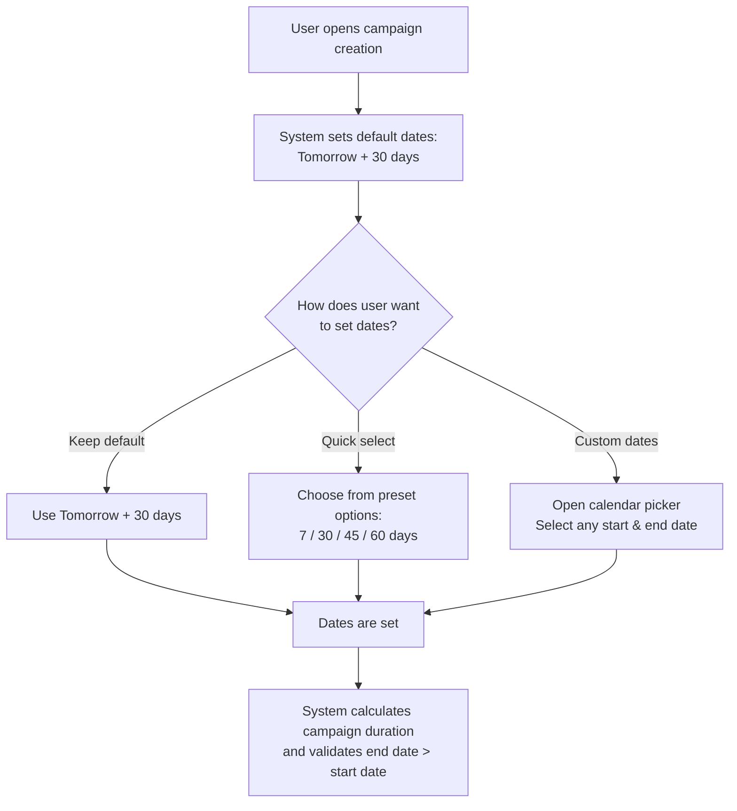

**Customizing quick selection options:**

Different users have different planning needs. Some prefer shorter campaign windows while others plan further ahead. The Configuration page allows you to customize the quick selection options to match your workflow. For example, you might prefer options like "Next 5 days," "Next 15 days," and "Next 28 days" instead of the default options.

*Note: Detailed instructions for customizing date options are available in the Configuration Guide (linked separately).*

---

### Client Type

The Client Type field tells the system who this campaign is being created for. This setting affects what options you see throughout the campaign creation process.

**There are two client types:**
- **Direct Advertiser** – The campaign is for a brand or company that is advertising directly
- **Agency** – The campaign is being created by or for a media/advertising agency

**What you see depends on who you are:**

The system shows different options based on your account type. The following table shows which client type options are available for each user role:

| User Role | Direct Advertiser | Agency | Default Selection |
|-----------|-------------------|--------|-------------------|
| Media Owner | ✓ Can select | ✓ Can select | Must choose |
| Internal (MW Staff) | ✓ Can select | ✓ Can select | Must choose |
| Partner (Reseller) | ✓ Can select | ✓ Can select | Must choose |
| Agency User | ✗ Not available | ✓ Pre-selected | Agency (automatic) |
| Advertiser (Media Buyer) | ✓ Pre-selected | ✗ Not available | Direct Advertiser (automatic) |

**Detailed explanation by user role:**

**If you are a Media Owner, Internal, or Partner:**

You have the flexibility to create campaigns for both direct advertisers and agencies. When you select:
- **Direct Advertiser**: You proceed directly to brand selection. No agency selection is needed.
- **Agency**: You must select or create an agency before proceeding.

**If you are an Agency User:**

The client type is automatically set to "Agency" and your company name is shown. You cannot change this to "Direct Advertiser" because your organization operates as an agency. If your agency has child companies (sub-agencies or regional offices), you can select from those instead.

**If you are an Advertiser (Media Buyer):**

The client type is automatically set to "Direct Advertiser." You cannot change this to "Agency" because your organization is the advertiser, not an intermediary.

---

### Agency Selection

When you select "Agency" as the client type, you need to specify which agency the campaign is for.

#### For Agency Users

If you are logged in as an agency user:
1. Your company name is automatically displayed as the selected agency
2. If your agency has child companies (sub-agencies or regional offices), you can select from a dropdown showing those options
3. The campaign will be associated with whichever agency you select

#### For Media Owners

When a media owner creates a campaign for an agency client:
1. You see a list of agencies you have previously worked with
2. This list is built from your business relationships in Account Management
3. You can search by typing the agency name
4. If the agency exists in your relationships, select it from the dropdown

**Example use case:**

Imagine you are UrbanMedia, a media owner with billboards across Malaysia. You have worked with three agencies before: GroupM Malaysia, Dentsu Malaysia, and Publicis Singapore. When you create a campaign with client type "Agency," you will see these three agencies in your dropdown because they are already mapped to your account.

#### Adding a New Agency

If the agency you need is not in your list, you can create it directly. However, the rules for agency creation differ based on your user type.

**Agency creation rules by user type:**

| User Role | Can Create Agency? | What Happens When Created |
|-----------|-------------------|---------------------------|
| Media Owner | ✓ Yes, always | Created as **parent account** in Account Management |
| Internal (MW Staff) | ✓ Yes, always | Created as **parent account** in Account Management |
| Partner (Reseller) | ✓ Yes, always | Created as **parent account** in Account Management |
| Agency User | Only if enabled* | Created as **child account** under your agency |

*Agency users can only create new agencies if this permission is enabled for them in Account Management. This permission is called "Allow Child Agency Creation" and is managed by your company administrator. Contact your administrator if you need this capability.

**Understanding Parent vs. Child Accounts:**

When an agency is created, it can be either a "parent" account or a "child" account. This distinction is important for understanding organizational hierarchy:

- **Parent Account**: A top-level agency that operates independently. It can have child accounts under it but does not report to another agency in the system.

- **Child Account**: An agency that belongs to a parent agency. This is typically used for regional offices, sub-brands, or subsidiary agencies.

**Example of parent-child relationship:**

```
GroupM Holdings (Parent)
├── GroupM Malaysia (Child)
├── GroupM Singapore (Child)
├── GroupM Indonesia (Child)
└── Mindshare (Child - subsidiary agency)
```

When a media owner, internal user, or partner creates an agency, it is always created as a parent account because they are adding a new business relationship. The MW support team can later restructure this into a child account if needed.

When an agency user creates an agency (if permitted), it is created as a child account under their own agency because they are expanding their organization's structure, not creating an entirely new business entity.

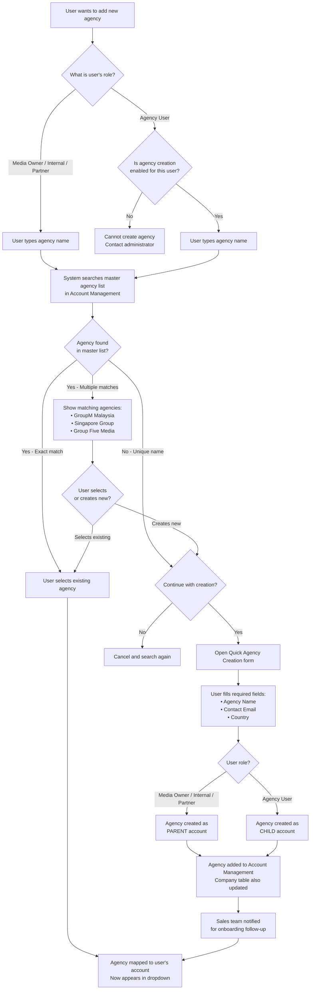

**What information is required to create an agency?**

When creating a new agency, you need to provide:

| Field | Required | Description |
|-------|----------|-------------|
| Agency Name | Yes | The official name of the agency |
| Contact Email | Yes | Primary email address for business communication |
| Country | Yes | The country where the agency operates |

This is a "quick creation" form with minimal required fields. The MW sales team will be notified about the new agency and can follow up to complete the full onboarding process, collecting additional details like:
- Full address
- Phone number
- Company logo
- Billing information
- Team member details

**Understanding agency mapping:**

When you select or create an agency, the system creates a "mapping" between your account and that agency. This mapping is important because:

1. **Future access**: Once mapped, that agency appears in your dropdown for all future campaigns
2. **Business relationships**: The mapping represents a business relationship in the platform
3. **Data visibility**: You can see campaigns and activities related to your mapped agencies

**Example of mapping in action:**

Let's say you are a media owner called "CityBillboards" and you create a campaign for a new agency called "BrandBoost Agency."

Before creation:
- Your agency dropdown shows: Agency A, Agency B (your existing partners)

After creation:
- BrandBoost Agency is added to Account Management as a new parent company
- A mapping is created between CityBillboards and BrandBoost Agency
- Your agency dropdown now shows: Agency A, Agency B, BrandBoost Agency
- BrandBoost Agency is also added to the Company table, enabling the MW sales team to reach out and onboard them properly

---

### Brand Selection (Optional)

Adding a brand to your campaign is optional but recommended. Brand information helps the system provide better recommendations for inventory selection and targeting.

#### How Brand Selection Works

Brands, like agencies, are stored in the Account Management platform (accounts.movingwalls.com). When you start typing a brand name, the system searches the master brand list and shows matching results.

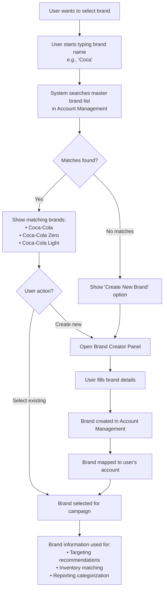

#### Creating a New Brand

When you create a new brand, you can provide the following information:

| Field | Required | Description |
|-------|----------|-------------|
| Brand Name | Yes | The official brand name (e.g., "Coca-Cola", "Nike", "Samsung") |
| IAB Category | Yes | The industry category from the IAB (Interactive Advertising Bureau) taxonomy |
| Website | No | The brand's official website URL |
| Logo | No | An image file for the brand logo (PNG or JPG, up to 5MB) |

**IAB Categories explained:**

The IAB Category helps classify the brand by industry. This classification is used for:
- Matching brands with appropriate advertising inventory
- Targeting audiences interested in specific industries
- Reporting and analytics by industry segment

Available categories include:
- Arts & Entertainment
- Automotive
- Business
- Education
- Food & Drink
- Health & Fitness
- Sports
- Technology & Computing
- Travel
- And many more...

**What happens when you create a brand:**

1. The brand is added to the master brand list in Account Management
2. A mapping is created between the brand and your account
3. The brand appears in your brand dropdown for future campaigns
4. Other users can also find and use this brand (it becomes part of the shared master list)

**Example use case:**

You are creating a campaign for a new restaurant chain called "TasteHub" that hasn't been advertised on the platform before.

1. You type "TasteHub" in the brand field
2. No matches are found
3. You click "Create New Brand"
4. You enter:
   - Brand Name: TasteHub
   - IAB Category: Food & Drink (IAB8)
   - Website: https://tastehub.com
   - Logo: Upload the TasteHub logo
5. The brand is created and automatically selected for your campaign
6. Future campaigns for TasteHub can simply select it from the dropdown

---

### External ID (Optional)

The External ID field allows you to link this campaign to records in other systems you use.

**When to use External ID:**

- Your company uses an internal campaign tracking system with its own ID format
- The same campaign exists in another advertising platform
- You need to match reports between MW Planner and other tools
- Your accounting system requires a specific reference number

**Example:**

Your company's internal system assigns the code "MKT-2025-Q4-001" to all Q4 marketing campaigns. By entering this as the External ID, you can:
- Search for the campaign in MW Planner using "MKT-2025-Q4-001"
- Match campaign performance data with your internal reports
- Maintain consistency across your marketing technology stack

---

### Execution Plan

The Execution Plan determines how your campaign will be processed after you complete the setup. This is an important choice that affects your workflow, approval process, and the options available to you.

#### Understanding the Three Execution Plans

```
┌─────────────────────────────────────────────────────────────────────────────────┐
│                         EXECUTION PLAN OPTIONS                                   │
└─────────────────────────────────────────────────────────────────────────────────┘

┌─────────────────────────────────────────────────────────────────────────────────┐
│                                                                                  │
│  ⚡ QUICK LAUNCH (Open Auction)                                                 │
│  ─────────────────────────────────                                              │
│                                                                                  │
│  Your campaign goes to Activate (activate.movingwalls.com) for programmatic     │
│  execution through open auction.                                                 │
│                                                                                  │
│  How it works:                                                                   │
│  1. Campaign is sent to Activate platform                                        │
│  2. You set bid rates for digital inventory (DOOH)                              │
│  3. Campaign competes in real-time auction for ad slots                         │
│  4. No guaranteed placement - you get spots when your bid wins                  │
│                                                                                  │
│  Best for:                                                                       │
│  • Digital out-of-home (DOOH) inventory                                         │
│  • Campaigns needing real-time optimization                                      │
│  • Flexible budgets and timing                                                   │
│  • Self-service, faster time to market                                          │
│                                                                                  │
└─────────────────────────────────────────────────────────────────────────────────┘

┌─────────────────────────────────────────────────────────────────────────────────┐
│                                                                                  │
│  📋 FULL WORKFLOW (Traditional/Guaranteed) - DEFAULT                            │
│  ──────────────────────────────────────────────────                             │
│                                                                                  │
│  Your campaign goes through the complete approval and negotiation process       │
│  for guaranteed placement.                                                       │
│                                                                                  │
│  How it works:                                                                   │
│  1. Campaign goes through approval workflow                                      │
│  2. Prices can be negotiated with media owners                                  │
│  3. Inventory is reserved for your exclusive use                                │
│  4. Guaranteed delivery at agreed terms                                          │
│                                                                                  │
│  Best for:                                                                       │
│  • Traditional billboards and static inventory                                   │
│  • Premium placements requiring specific locations                               │
│  • Fixed pricing with media owners                                               │
│  • High-value campaigns where placement matters                                  │
│                                                                                  │
└─────────────────────────────────────────────────────────────────────────────────┘

┌─────────────────────────────────────────────────────────────────────────────────┐
│                                                                                  │
│  🤝 REQUEST FOR DEAL                                                            │
│  ─────────────────────                                                          │
│                                                                                  │
│  Your campaign goes to Influence (influence.movingwalls.com) for deal creation, │
│  combining programmatic efficiency with guaranteed inventory.                    │
│                                                                                  │
│  How it works:                                                                   │
│  1. Campaign is sent to Influence platform                                       │
│  2. Media owners create deals (PG or Preferred Deal) for your inventories       │
│  3. Deals are sent to the advertiser in Activate for acceptance                 │
│  4. Once accepted, campaign runs with programmatic efficiency                   │
│                                                                                  │
│  Deal types available:                                                           │
│  • Programmatic Guaranteed (PG) - Fixed price, guaranteed inventory             │
│  • Preferred Deal - Priority access at negotiated rates                         │
│  • Hybrid - Combination of programmatic and traditional execution               │
│                                                                                  │
│  Best for:                                                                       │
│  • Premium inventory with negotiated rates                                       │
│  • Advertisers wanting programmatic efficiency with guarantees                  │
│  • Complex campaigns mixing DOOH and traditional inventory                      │
│                                                                                  │
└─────────────────────────────────────────────────────────────────────────────────┘
```

#### Execution Plan Availability by User Role

Not all users see all three options. The system shows only the execution plans that are available based on your account type and product subscriptions.

| User Role | Quick Launch | Full Workflow | Request for Deal |
|-----------|--------------|---------------|------------------|
| Media Owner | ✗ Not available | ✓ Available (Default) | ✓ If Influence access |
| Internal (MW Staff) | ✓ If Activate access | ✓ Available (Default) | ✓ If Influence access |
| Partner (Reseller) | ✓ If Activate access | ✓ Available (Default) | ✓ If Influence access |
| Agency | ✓ If Activate subscription | ✓ Available (Default) | ✓ If Influence access |
| Advertiser | ✓ If Activate subscription | ✓ Available (Default) | ✓ If Influence access |

**Why Media Owners don't see Quick Launch:**

Media owners own the advertising inventory. They don't need to participate in open auctions for their own inventory - they control it directly. Instead, they use Full Workflow to manage how their inventory is sold and Request for Deal to create programmatic deals for advertisers.

**Internal and Partner access to Quick Launch:**

Internal MW staff and Partners can use Quick Launch if they have been granted access to Activate. This allows them to run programmatic campaigns on behalf of clients or for testing purposes.

```mermaid
flowchart TD
    subgraph "Quick Launch Path"
        A1[Campaign Created] --> B1[Sent to Activate]
        B1 --> C1[Set bid rates]
        C1 --> D1[Compete in auction]
        D1 --> E1[Win slots when bid succeeds]
    end
    
    subgraph "Full Workflow Path"
        A2[Campaign Created] --> B2[Approval Workflow]
        B2 --> C2[Price Negotiation]
        C2 --> D2[Inventory Reserved]
        D2 --> E2[Guaranteed Delivery]
    end
    
    subgraph "Request for Deal Path"
        A3[Campaign Created] --> B3[Sent to Influence]
        B3 --> C3[Media Owner creates deals]
        C3 --> D3[Deal sent to advertiser]
        D3 --> E3[Advertiser accepts in Activate]
        E3 --> F3[Campaign runs programmatically]
    end
```

---

### Quick Tips Panel

As you fill out the Campaign Details form, a Quick Tips panel on the right side of the screen provides helpful guidance. The tips change dynamically based on:

- Which field you are currently working on
- The execution plan you have selected
- Your user type

**Tips by execution plan:**

| Execution Plan | Tips Shown |
|----------------|------------|
| Quick Launch | Tips about Activate platform, bid rates, DOOH inventory, real-time optimization |
| Full Workflow (for Media Owners) | Tips about Influence platform, line items, targeting, adserver configuration |
| Full Workflow (for Agencies/Advertisers) | Tips about working with media owners, approval process, account manager support |
| Request for Deal | Tips about deal types (PG, Preferred Deal), negotiation process, hybrid execution |

These tips help you understand how your choices affect the campaign workflow without needing to leave the page or consult separate documentation.

---

## User Role Summary: Complete Step 1 Experience

The following table summarizes how Step 1 differs for each user role:

| Aspect | Media Owner | Agency | Advertiser | Internal/Partner |
|--------|-------------|--------|------------|------------------|
| Client Type Options | Both available | Agency only (fixed) | Direct Advertiser only (fixed) | Both available |
| Agency Selection | See agencies worked with | Own company pre-selected | N/A | See all agencies |
| Can Create Agency | Yes (as parent) | Only if enabled (as child) | No | Yes (as parent) |
| Brand Selection | Available | Available | Available | Available |
| Can Create Brand | Yes | Yes | Yes | Yes |
| Execution Plans | Full Workflow, Request for Deal | All three (with subscriptions) | All three (with subscriptions) | All three (with access) |
| Default Execution Plan | Full Workflow | Full Workflow | Full Workflow | Full Workflow |

---

## Detailed Flow by User Role

This section provides step-by-step walkthroughs of Step 1 for each user role, showing exactly what you experience and what happens behind the scenes.

### Media Owner Flow

Media owners are companies that own and operate advertising inventory (billboards, digital screens, etc.). When a media owner creates a campaign, they are typically selling their inventory to agencies or direct advertisers.

```mermaid
flowchart TD
    subgraph "Step 1: Campaign Details - Media Owner Flow"
        A[Media Owner logs in] --> B[Opens Campaign Creation]
        B --> C[Campaign Name auto-generated:<br/>Campaign_Nov_30_25_001]
        C --> D[Dates default to:<br/>Tomorrow + 30 days]
        D --> E{Select Client Type}
        
        E -->|Direct Advertiser| F[Skip agency selection<br/>Proceed to brand selection]
        E -->|Agency| G[Agency dropdown appears]
        
        G --> H{Agency in list?}
        H -->|Yes| I[Select existing agency]
        H -->|No| J[Click Create New Agency]
        
        J --> K[Fill Quick Agency Form:<br/>• Name ✓<br/>• Email ✓<br/>• Country ✓]
        K --> L[Agency created as PARENT<br/>in Account Management]
        L --> M[Agency mapped to<br/>Media Owner's account]
        M --> I
        
        I --> N[Optional: Select or Create Brand]
        F --> N
        
        N --> O{Select Execution Plan}
        O --> P[Full Workflow<br/>Traditional guaranteed]
        O --> Q[Request for Deal<br/>If Influence access enabled]
        
        P --> R[Proceed to Step 2]
        Q --> R
    end
```

**What the Media Owner sees:**
1. Both client type options (Direct Advertiser and Agency)
2. Agency dropdown with all previously worked-with agencies
3. "Create New Agency" option always visible
4. Execution plans: Full Workflow and Request for Deal (no Quick Launch)
5. Quick Tips tailored for inventory sellers

**Behind the scenes:**
- New agencies are created as parent accounts in Account Management
- The Company table is updated for sales team follow-up
- Agency mappings enable future campaign creation without re-searching

---

### Internal (MW Staff) and Partner (Reseller) Flow

Internal users are Moving Walls employees, and Partners are resellers who work on behalf of Moving Walls. Both have similar capabilities to Media Owners with some additional visibility into platform data.

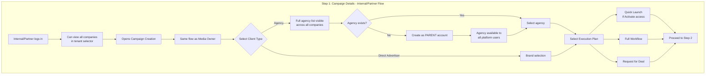

**Key differences from Media Owner:**
1. Can see and create campaigns for any company they have access to
2. May have access to additional analytics and platform-wide data
3. Agencies they create become visible to all platform users (not just their mapped relationships)
4. Internal users often assist with onboarding and troubleshooting
5. Can use Quick Launch if they have been granted access to Activate

---

### Agency User Flow

Agency users work for advertising or media agencies. They create campaigns on behalf of their agency to run advertisements for their clients (advertisers).

```mermaid
flowchart TD
    subgraph "Step 1: Campaign Details - Agency User Flow"
        A[Agency User logs in] --> B[Opens Campaign Creation]
        B --> C[Campaign Name auto-generated]
        C --> D[Dates default to 30 days]
        
        D --> E[Client Type: AGENCY<br/>Fixed - cannot change]
        E --> F[Agency: Own company shown<br/>or child companies if exist]
        
        F --> G{Has child agencies?}
        G -->|Yes| H[Can select from:<br/>• Own company<br/>• Child company 1<br/>• Child company 2]
        G -->|No| I[Own company selected<br/>No dropdown shown]
        
        H --> J{Want to create<br/>new child agency?}
        I --> K[Proceed to brand selection]
        
        J -->|No| K
        J -->|Yes| L{Permission enabled<br/>in Account Management?}
        
        L -->|No| M[Create option hidden<br/>Contact administrator]
        L -->|Yes| N[Fill Quick Agency Form]
        
        N --> O[Agency created as CHILD<br/>under user's parent agency]
        O --> P[Child agency added to<br/>user's agency dropdown]
        P --> K
        M --> K
        
        K --> Q[Optional: Select or Create Brand]
        Q --> R{Select Execution Plan}
        
        R --> S[Quick Launch<br/>If Activate subscription]
        R --> T[Full Workflow<br/>Always available]
        R --> U[Request for Deal<br/>If Influence access]
        
        S --> V[Proceed to Step 2]
        T --> V
        U --> V
    end
```

**What the Agency User sees:**
1. Client type is fixed to "Agency" (cannot select Direct Advertiser)
2. Own company name shown, or dropdown of parent + child companies
3. Create Agency option only visible if permission enabled
4. All three execution plans available (with appropriate subscriptions)
5. Quick Tips about working with media owners and approval processes

**Behind the scenes:**
- The "Allow Child Agency Creation" permission is checked from Account Management
- New agencies created by agency users are always child accounts under their parent
- This maintains organizational hierarchy and prevents agencies from creating competitors

---

### Advertiser (Media Buyer) Flow

Advertisers are the brands or companies that want to advertise. They are the end clients in the advertising chain.

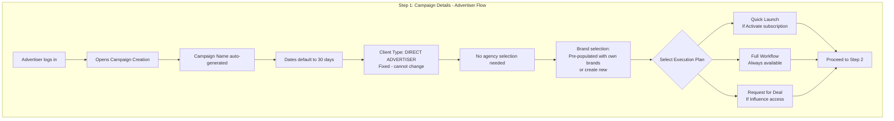

**What the Advertiser sees:**
1. Client type is fixed to "Direct Advertiser" (cannot select Agency)
2. No agency selection field
3. Brand field pre-populated with brands already associated with their account
4. All three execution plans available (with appropriate subscriptions)
5. Quick Tips about campaign goals and reaching target audiences

**Simplest flow:**
Advertisers have the most streamlined experience because:
- No client type selection needed
- No agency selection needed
- Brands they've used before are immediately available
- Focus is on their own advertising needs

---

## Data Synchronization: Planner and Account Management

Understanding how data flows between Planner and Account Management helps clarify what happens when you create agencies or brands.

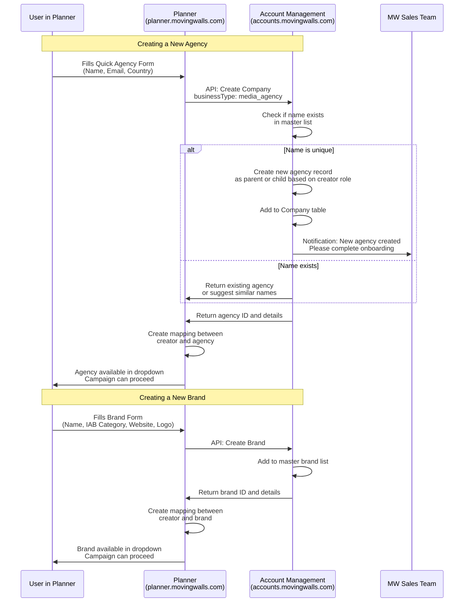

**Key points about data synchronization:**

1. **Planner never stores agencies or brands locally** - it always queries Account Management
2. **Mappings are stored in Planner** - these connect your account to specific agencies/brands
3. **Master lists are shared** - once an agency or brand exists, any user can find it by searching
4. **Notifications are sent** - the MW sales team is alerted when new agencies are created for follow-up

---

# Step 2: Budget & Location

After completing your campaign details in Step 1, you'll now define where your campaign will run and optionally set your budget and goals. This step helps the system understand your market focus so it can show you relevant inventory options and provide better recommendations.

Think of this step like telling a travel agent where you want to go and how much you'd like to spend. The more information you provide, the better recommendations you'll receive.

---

## What You'll Do in This Step

1. **Select a Country (Required)** – Choose the market where you want to run your campaign
2. **Set a Budget (Optional)** – Define how much you want to spend
3. **Choose a Campaign Goal (Optional)** – Tell the system what you're trying to achieve

While only the country selection is required, providing budget and goal information helps the system give you smarter recommendations for inventory selection and scheduling.

---

## Country Selection (Market Selection)

The first and most important choice in Step 2 is selecting the country where you want your advertisements to appear. This selection affects everything that follows:

- **Currency**: Automatically set based on the country
- **Available Inventory**: Only inventory in the selected country will be shown
- **Market Insights**: Population, available inventories, and potential impressions for that country

### How Country Options Are Determined

The countries you can select from depend on your user role and company setup:

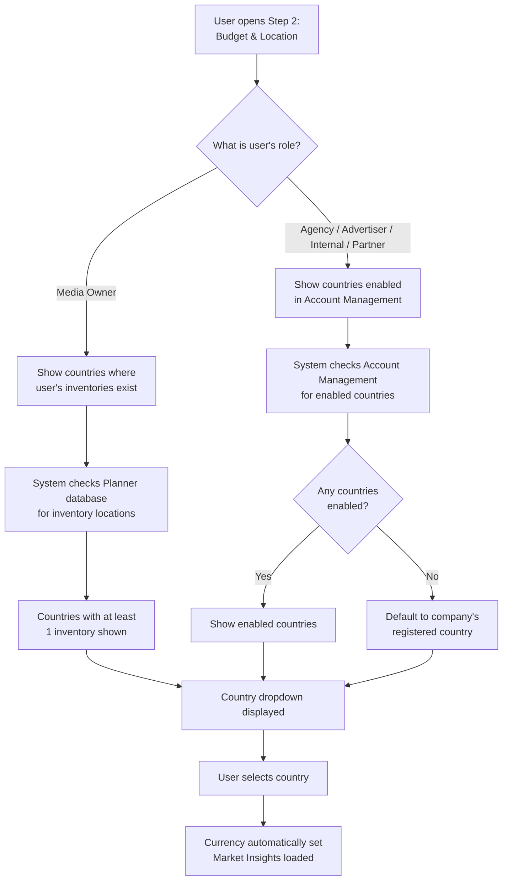

**For Media Owners:**

If you are a media owner, you'll only see countries where you have registered inventories. This makes sense because you can only sell what you own. If you have billboards in Malaysia and Singapore, those are the only countries in your dropdown.

**For Everyone Else:**

If you are an agency, advertiser, internal user, or partner, the countries shown are based on what's enabled for your account in Account Management. This is typically set up when your company onboards to the platform.

By default, your account is enabled for the country where your company is registered. For example, if your agency is registered in Malaysia, you'll see Malaysia as the default (and possibly only) option unless additional countries have been enabled.

**Example scenarios:**

| User Type | Company Location | Countries Enabled | What They See |
|-----------|------------------|-------------------|---------------|
| Media Owner (UrbanMedia) | Malaysia | N/A - based on inventory | Malaysia, Singapore (where they have billboards) |
| Agency (GroupM Malaysia) | Malaysia | Malaysia only | Malaysia |
| Agency (GroupM APAC) | Singapore | Malaysia, Singapore, Thailand, Indonesia | All four countries |
| Advertiser (Nike Malaysia) | Malaysia | Malaysia, Singapore | Malaysia, Singapore |
| Internal (MW Staff) | Malaysia | All countries | Full country list |

> **Note on Current Implementation:** The country filtering logic described above represents the target architecture. Currently, the system displays a configured list of supported countries (Malaysia, United States, United Kingdom, Singapore, Australia). Role-based country filtering based on inventory ownership and Account Management settings is planned for future implementation. See the backlog for "Dynamic Country Filtering" enhancement.

### What Happens When You Select a Country

When you choose a country, several things happen immediately:

1. **Currency Updates**: The currency field automatically changes to match the country
2. **Market Insights Load**: The right side of the screen shows a country map and market statistics
3. **Inventory Scope Set**: When you reach the inventory selection step, only inventory in this country will be shown

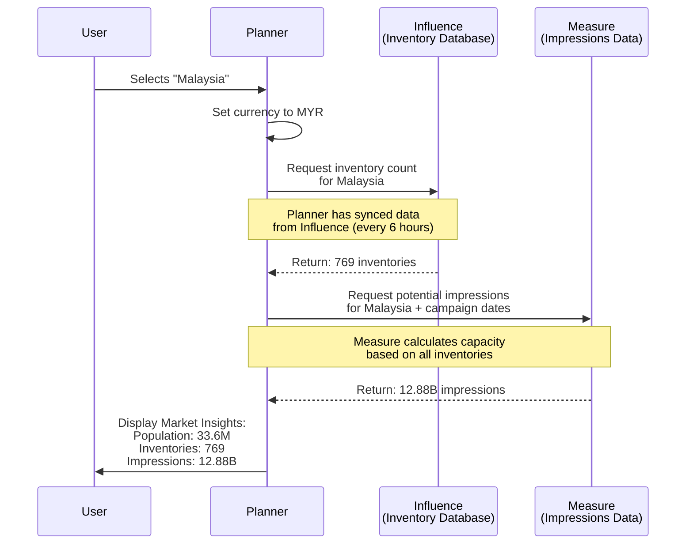

---

## Understanding the Market Insights Panel

When you select a country, a panel on the right side of the screen displays market insights. This panel helps you understand the advertising potential in your chosen market.

### What the Panel Shows

```
┌─────────────────────────────────────────────────────────────┐
│  Market Insights                              Malaysia      │
├─────────────────────────────────────────────────────────────┤
│                                                              │
│  ┌───────────────────┐  ┌────────────────────────────────┐ │
│  │                   │  │  Population                     │ │
│  │   [Country Map]   │  │  33.6M                          │ │
│  │   (Shape/Outline) │  │                                 │ │
│  │                   │  ├────────────────────────────────┤ │
│  │                   │  │  Inventories                    │ │
│  │                   │  │  769                            │ │
│  │                   │  │                                 │ │
│  │                   │  ├────────────────────────────────┤ │
│  │                   │  │  Impressions                    │ │
│  │                   │  │  12.88B                         │ │
│  └───────────────────┘  └────────────────────────────────┘ │
│                                                              │
└─────────────────────────────────────────────────────────────┘
```

### What Each Metric Means

| Metric | What It Represents | Where It Comes From |
|--------|-------------------|---------------------|
| **Population** | Total population of the country | Static demographic data |
| **Inventories** | Total number of advertising spaces available | Synced from Influence every 6 hours |
| **Impressions** | Potential total ad views across all inventories | Calculated by Measure based on campaign duration |

> **Note on Current Implementation:** The market insights currently display pre-configured reference data for supported countries. As the platform matures, this data will be dynamically updated through the Influence and Measure integrations described below. The architecture and data flow documented here represents the target state that enables real-time market intelligence.

### How Inventory Count Is Calculated

The inventory count shown is the **total number of advertising spaces** in Planner's database for that country. This is a raw count that includes:

- All types: billboards, digital screens, transit ads, retail displays, etc.
- All availability states: both available and already booked inventory
- All media owners: inventory from every media owner in that country

This number is **unfiltered** - it doesn't account for:
- Your campaign's specific date availability
- Brand category exclusions
- Blacklisted inventory
- Inventory you may not have access to

Think of it as the total market size, not what's specifically available for your campaign. When you reach the inventory selection step later, filters will narrow this down to what you can actually book.

### How Impressions Are Calculated

The impressions number represents the **total potential ad views** that could be generated across all inventories during your campaign period. This is calculated using data from Measure, Moving Walls' audience measurement system.

**What goes into this calculation:**

1. **Daily impressions per inventory**: Each billboard or screen has measured traffic data
2. **Campaign duration**: The number of days between your start and end date
3. **Operating hours**: When each inventory is actually running

**Example calculation:**

If you have a 30-day campaign in a country with 769 inventories, and the average inventory generates 500,000 impressions per day:
```
769 inventories × 500,000 daily impressions × 30 days = 11.5 billion potential impressions
```

This is a **capacity number** - the maximum possible impressions if you booked every single inventory for your entire campaign. Your actual campaign will likely use a subset of these inventories.

---

## Platform Integration: How Data Flows

To understand where the market insights come from, it helps to understand how MW Planner connects with other Moving Walls platforms:

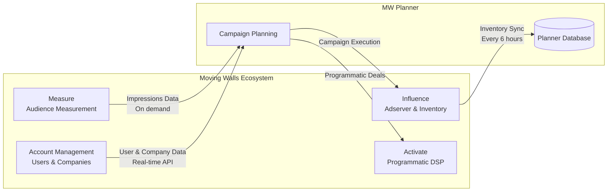

### Influence Integration (Inventory Data)

**Influence** is Moving Walls' adserver platform where media owners manage their inventory. It's the "source of truth" for all advertising spaces.

**Target Architecture - How the sync will work:**

1. Media owners add, edit, or remove inventory in Influence
2. Every 6 hours, Planner automatically syncs with Influence
3. The sync updates Planner's database with:
   - New inventories added
   - Updated specifications (dimensions, pricing, etc.)
   - Removed or deactivated inventories
   - Location changes

**Why 6 hours?**

Inventory data doesn't change constantly - most updates happen during business hours when media owners are working. A 6-hour sync interval balances data freshness with system performance. Critical updates (like an inventory being sold out) are handled separately through real-time availability checks during booking.

> **Current State:** Planner currently maintains its own inventory database that can be populated through CSV import or manual entry. The automated sync with Influence is part of the platform roadmap and will be implemented as the integration matures.

### Measure Integration (Impressions Data)

**Measure** is Moving Walls' audience measurement platform. It tracks how many people pass by or see each advertising space.

**Target Architecture - What Measure will provide:**

- Historical traffic patterns
- Time-of-day variations
- Day-of-week patterns
- Demographic estimates
- Seasonal adjustments

**When Planner will ask Measure for data:**

- When you select a country (for market-level impressions)
- When you select specific inventories (for detailed forecasting)
- When you adjust campaign dates (to recalculate capacity)

> **Current State:** Impressions data is currently displayed using reference figures based on industry benchmarks for each country. Real-time Measure integration for dynamic impression calculation is planned as the platform integration evolves.

---

## Budget Setup (Optional)

Setting a budget is optional but recommended. When you provide a budget, the system can:

- Recommend inventory combinations that fit your budget
- Show you cost-efficiency comparisons
- Alert you if your selections exceed your budget
- Optimize schedule allocation for best value

### How Budget Works

```
┌─────────────────────────────────────────────────────────────┐
│  Budget Setup                                                │
│  Set your campaign budget (optional)                         │
├─────────────────────────────────────────────────────────────┤
│                                                              │
│  ┌─────────────────┐  ┌────────────────────────────────────┐│
│  │  Currency       │  │  Budget (Optional)                 ││
│  │  [MYR      ]    │  │  [                           ]     ││
│  │  (read-only)    │  │  Enter budget in MYR               ││
│  └─────────────────┘  └────────────────────────────────────┘│
│                                                              │
└─────────────────────────────────────────────────────────────┘
```

### Currency Is Automatic

The currency field is automatically set based on your country selection and cannot be changed. This ensures consistency across the campaign:

| Country | Currency Code | Currency Symbol |
|---------|---------------|-----------------|
| Malaysia | MYR | RM |
| United States | USD | $ |
| United Kingdom | GBP | £ |
| Singapore | SGD | S$ |
| Australia | AUD | A$ |

### Budget Best Practices

**When to set a budget:**
- You have a defined marketing spend for this campaign
- You want the system to recommend cost-effective options
- You need to stay within a specific spending limit

**When to skip the budget:**
- You're exploring options and haven't finalized spending
- The budget will be determined based on inventory selection
- You're creating a test or draft campaign

---

## Campaign Goals (Optional)

Setting a campaign goal tells the system what you're trying to achieve. This helps with:

- Smarter inventory recommendations
- Appropriate metrics tracking
- Strategy tips and guidance
- Performance benchmarking

### Available Goal Types

The platform supports three primary campaign goals:

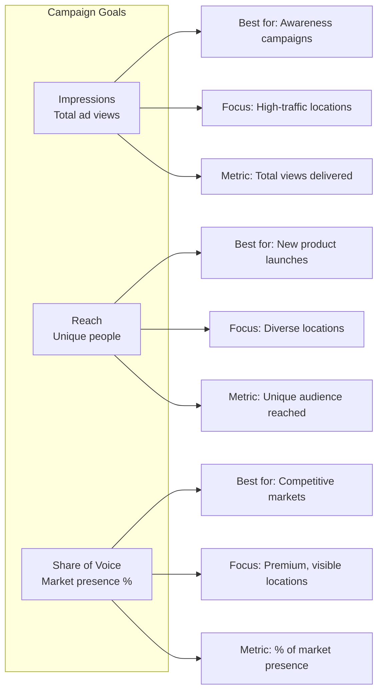

#### Impressions

**What it means:** The total number of times your advertisement is displayed or viewed.

**When to choose this:**
- You want maximum exposure
- Brand awareness is your priority
- You're running a short-term promotional campaign

**How the system helps:**
- Recommends high-traffic locations
- Suggests digital screens with high rotation rates
- Prioritizes locations with proven audience traffic

**Target value example:** 1,000,000 impressions

---

#### Reach

**What it means:** The number of unique individuals who see your advertisement at least once.

**When to choose this:**
- You want to reach as many different people as possible
- You're introducing a new product or brand
- You want broad geographic coverage

**How the system helps:**
- Recommends diverse locations to avoid audience overlap
- Suggests a mix of location types (transit, street, mall)
- Balances urban and suburban coverage

**Target value example:** 500,000 unique people

---

#### Share of Voice (SOV)

**What it means:** Your brand's presence as a percentage of total advertising activity in the market.

**When to choose this:**
- You're in a competitive market with active rivals
- You need to maintain or grow brand dominance
- You're defending market share during a competitor's campaign

**How the system helps:**
- Recommends premium, high-visibility locations
- Suggests sustained presence over the campaign period
- Monitors competitor activity in target areas

**Target value example:** 25% share of voice

---

### Goal Selection Interface

When you select a goal, the interface updates to show relevant input fields:

```
┌─────────────────────────────────────────────────────────────┐
│  Campaign Goal                                               │
│  Define your campaign objective (optional)                   │
├─────────────────────────────────────────────────────────────┤
│                                                              │
│  ┌─────────────────────┐  ┌──────────────────────────────┐ │
│  │  Goal Type          │  │  Target Value                │ │
│  │  [Impressions    ▼] │  │  [1,000,000            ]     │ │
│  │                     │  │  Enter target impressions    │ │
│  └─────────────────────┘  └──────────────────────────────┘ │
│                                                              │
│  Description: Total number of ad views/exposures to your    │
│  target audience.                                            │
│                                                              │
└─────────────────────────────────────────────────────────────┘
```

### Target Values

When you select a goal type, you can optionally enter a target value:

| Goal Type | Unit | Example Target | What It Means |
|-----------|------|----------------|---------------|
| Impressions | impressions | 1,000,000 | You want at least 1 million ad views |
| Reach | people | 500,000 | You want to reach half a million unique individuals |
| Share of Voice | % | 25 | You want 25% of advertising presence in your market |

Setting a target value helps the system:
- Recommend the right number of inventories
- Estimate budget requirements
- Alert you if your selections won't meet the target
- Track progress toward your goal

---

## Quick Tips Panel

As you work through Step 2, a Quick Tips panel provides contextual guidance. The tips change based on what you're doing and what goal you've selected.

### How Quick Tips Work

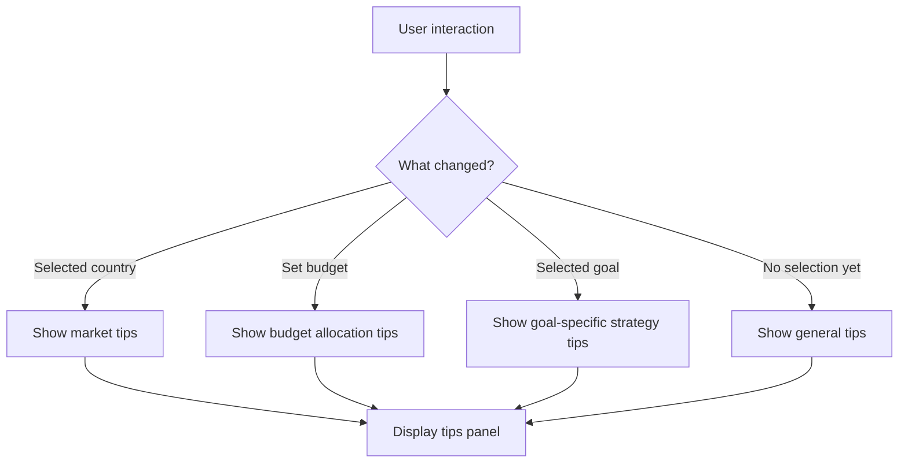

### Tips by Goal Type

**When no goal is selected:**
- "Set a clear campaign goal to get better recommendations"
- "Goals help optimize inventory selection and targeting"
- "You can change your goal later in the optimization step"

**When Impressions is selected:**
- "Focus on high-traffic locations and prime time slots"
- "Digital billboards typically deliver 2-3x more impressions"
- "Consider frequency capping to avoid audience fatigue"

**When Reach is selected:**
- "Diversify locations to maximize unique audience exposure"
- "Transit advertising excels at reaching broad demographics"
- "Mix of format types increases overall reach potential"

**When Share of Voice is selected:**
- "Premium locations in competitive categories are essential"
- "Sustained presence over time builds stronger brand recall"
- "Monitor competitor activity in your target markets"

> **Note on Goal Options:** The current implementation includes two additional goal types (Attribution and Other) that will be removed in a future update. These options do not provide meaningful guidance to the recommendation engine and are being deprecated. Only Impressions, Reach, and Share of Voice are the supported goal types for OOH campaign optimization.

---

## Step 2 Form Summary

Here's everything you can enter in Step 2:

| Field | Required | Description | Default |
|-------|----------|-------------|---------|
| Country | Yes | Market where campaign will run | Company's registered country |
| Currency | Auto | Set based on country selection | Follows country |
| Budget | No | Total campaign spend | None |
| Goal Type | No | Campaign objective (Impressions, Reach, SOV) | None |
| Target Value | No | Numeric target for selected goal | Goal-specific default |

---

## User Role Differences in Step 2

Different user types have slightly different experiences in Step 2:

| Aspect | Media Owner | Agency | Advertiser | Internal/Partner |
|--------|-------------|--------|------------|------------------|
| Country options | Based on inventory locations | Based on enabled countries | Based on enabled countries | All countries |
| Default country | First country with inventory | Company registered country | Company registered country | Malaysia (system default) |
| Budget visibility | Full visibility | Full visibility | Full visibility | Full visibility |
| Goal options | All three goals | All three goals | All three goals | All three goals |
| Market insights | See own inventory only* | See all inventory | See all inventory | See all inventory |

*Note: The inventory count shown to media owners may be filtered to their own inventory or may show market-wide data depending on platform configuration.

---

## Step 2 Summary

Step 2 of campaign creation establishes your market focus and optional campaign parameters:

| Field | Required | Purpose |
|-------|----------|---------|
| Country | Yes | Defines the market and sets currency |
| Budget | No | Enables cost recommendations and tracking |
| Goal Type | No | Guides inventory and strategy recommendations |
| Target Value | No | Sets measurable objective for the campaign |

**Key integrations:**
- **Influence** – Provides inventory count (synced every 6 hours)
- **Measure** – Provides potential impressions data
- **Account Management** – Determines which countries you can access

After completing Step 2, you'll move to Step 3: Targeting.

# Step 3: Targeting

Step 3 is where you define **who you want to reach** and **where you want to reach them**. This step allows you to narrow down your audience using demographic profiles, venue preferences, geographic boundaries, and real-time signals.

Think of targeting as creating a "blueprint" of your ideal customer. The more specific you are, the more relevant your campaign will be – but being too narrow might limit your reach. The system provides recommendations to help you find the right balance.

## Overview

```
┌────────────────────────────────────────────────────────────────────────────┐
│                           STEP 3: TARGETING                                │
├────────────────────────────────────────────────────────────────────────────┤
│                                                                            │
│  ┌──────────────────────────────────────────────────────────────────────┐  │
│  │ 💡 Targeting Recommendations                              [Apply]    │  │
│  │   Based on your campaign details, we recommend:                      │  │
│  │   [25-34 years] [35-44 years] [Middle income] [Upper-middle]        │  │
│  │   [Urban] [Business] [Transit]                                       │  │
│  └──────────────────────────────────────────────────────────────────────┘  │
│                                                                            │
│  ┌────────────────────┬────────────────────┬────────────────────┐         │
│  │  👥 Demographics   │   📍 Geofencing   │   ✨ Signals       │         │
│  │     & Venue        │                    │                    │         │
│  └────────────────────┴────────────────────┴────────────────────┘         │
│                                                                            │
│  ╔════════════════════════════════════════════════════════════════════╗   │
│  ║                    TAB CONTENT AREA                                ║   │
│  ║                                                                    ║   │
│  ║   (Content changes based on selected tab - see sections below)     ║   │
│  ║                                                                    ║   │
│  ╚════════════════════════════════════════════════════════════════════╝   │
│                                                                            │
│                                             [ Save Draft ] [ Continue → ]  │
└────────────────────────────────────────────────────────────────────────────┘
```

## The Three Targeting Tabs

Step 3 is organized into three tabs, each focusing on a different aspect of targeting:

| Tab | Purpose | What You Define |
|-----|---------|-----------------|
| **Demographics & Venue** | Who you want to reach and where | Age, gender, income, interests, venue types, audience behaviors |
| **Geofencing** | Geographic boundaries | Specific cities, regions, POIs, custom areas on a map |
| **Signals** | Real-time triggers | Weather, time-based, footfall, search behavior, local events |

---

## AI Recommendations Panel

At the top of the Targeting step, you'll see a recommendations panel. This uses information from your campaign details to suggest targeting options.

### How Recommendations Work

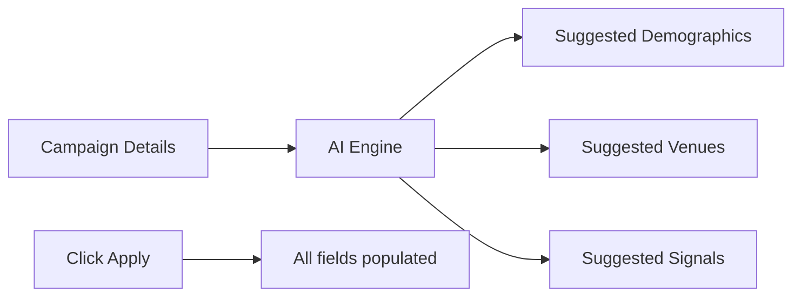

When you click **Apply**, the system fills in the targeting form with recommended values. You can then adjust individual fields to customize your targeting.

**What the AI considers:**
- Brand/advertiser industry (e.g., automotive, fashion, food)
- Campaign goal (impressions, reach, or share of voice)
- Selected country and market characteristics
- Historical data from similar successful campaigns

### Sample Recommendations Display

```
┌─────────────────────────────────────────────────────────────────────────┐
│ 💡 Targeting Recommendations                                  [ Apply ] │
│ Based on your campaign details, we recommend the following options      │
├─────────────────────────────────────────────────────────────────────────┤
│                                                                         │
│  [25-34 years]  [35-44 years]  [Middle income]  [Upper-middle income]  │
│  [Urban]  [Business]  [Transit]                                         │
│                                                                         │
└─────────────────────────────────────────────────────────────────────────┘
```

> **Current Implementation:** The recommendations shown are currently based on pre-configured defaults rather than dynamic AI analysis. The displayed badges represent a starting point suitable for most campaigns. Future enhancements will include machine learning-based recommendations that analyze campaign context, brand industry, and historical performance data.

---

## Tab 1: Demographics & Venue

This tab contains six selection fields organized in three rows. All fields support multiple selections – you can pick as many options as relevant to your campaign.

### Demographics & Venue Layout

```
┌────────────────────────────────────────────────────────────────────────────┐
│ DEMOGRAPHICS & VENUE TAB                                                   │
├────────────────────────────────────────────────────────────────────────────┤
│                                                                            │
│  ┌────────────────────────────┐  ┌────────────────────────────┐           │
│  │ Age Groups                 │  │ Gender                     │           │
│  │ [Select age groups... ▼]  │  │ [Select gender... ▼]      │           │
│  └────────────────────────────┘  └────────────────────────────┘           │
│                                                                            │
│  ┌────────────────────────────┐  ┌────────────────────────────┐           │
│  │ Income Brackets            │  │ Interests & Activities     │           │
│  │ [Select income levels...▼]│  │ [Select interests... ▼]   │           │
│  └────────────────────────────┘  └────────────────────────────┘           │
│                                                                            │
│  ┌────────────────────────────┐  ┌────────────────────────────┐           │
│  │ Venue Types                │  │ Audience Behavior          │           │
│  │ [Select venue types... ▼] │  │ [Select behaviors... ▼]   │           │
│  │ Based on OpenOOH taxonomy  │  │ Target specific behaviors  │           │
│  └────────────────────────────┘  └────────────────────────────┘           │
│                                                                            │
└────────────────────────────────────────────────────────────────────────────┘
```

### Age Groups

Age groups divide your potential audience by life stage. Select the age ranges that match your target customers.

| Option | Description | Typical Characteristics |
|--------|-------------|------------------------|
| **18-24** | Young adults | Students, early career, digitally native, trend-conscious |
| **25-34** | Young professionals | Career-building, starting families, brand-conscious |
| **35-44** | Established adults | Peak earning years, homeowners, family-focused |
| **45-54** | Middle-aged | Senior roles, empty nesters beginning, high spending power |
| **55-64** | Pre-retirement | Wealth accumulated, leisure time increasing |
| **65+** | Seniors | Retired, fixed income, health-focused |

**Default selection:** 25-34, 35-44 (the most economically active age groups)

> **Configurable Ranges:** The age group ranges shown above are the system defaults. Your organization can customize these ranges in the Configuration page. For example, instead of 18-24, you might configure 10-20, 21-30, etc. to match your market research methodology. See the Configuration Guide for details.

### Gender

Select the genders you want to reach with your campaign.

| Option | Description |
|--------|-------------|
| **Male** | Target male-identifying audience |
| **Female** | Target female-identifying audience |
| **Unknown** | Include audience where gender data is not available |

**Best practice:** Unless your product is gender-specific (e.g., men's razors, women's fashion), select all three options to maximize reach.

**Default selection:** Male, Female (both selected)

### Income Brackets

Income levels help you match your advertising to people who can afford your product or service. The system uses five income categories that describe relative economic segments:

| Category | Description | Typical Behavior |
|----------|-------------|------------------|
| **Low** | Lower income segment | Price-sensitive, value-conscious |
| **Lower-Middle** | Lower-middle income segment | Careful spenders, aspirational |
| **Middle** | Middle income segment | Mainstream consumers, balanced |
| **Upper-Middle** | Upper-middle income segment | Quality-focused, brand-conscious |
| **High** | Higher income segment | Premium buyers, luxury seekers |

**Default selection:** Middle, Upper-middle

#### How Income Ranges Work

The actual monetary ranges displayed for each category **change based on the selected country**. For example:

| Category | Malaysia (MYR) | Singapore (SGD) | United States (USD) |
|----------|----------------|-----------------|---------------------|
| Low | < 128,000/year | < 30,000/year | < 35,000/year |
| Middle | 213,000 - 426,000 | 60,000 - 120,000 | 50,000 - 100,000 |
| High | > 639,000/year | > 200,000/year | > 150,000/year |

*Note: The ranges shown above are examples. Actual values are configured per country.*

#### Recommendation Engine Behavior

**Important:** The recommendation engine and targeting algorithms only consider the **category labels** (low, middle, high) – not the specific monetary ranges. This means:

- When you select "Middle income," the system targets middle-income audiences regardless of whether that means MYR 300,000 or USD 75,000
- The recommendation engine analyzes venue demographics against these relative segments
- You can customize the actual ranges in the Configuration page to match your market definitions

> **Configurable Ranges:** Your organization can customize the income ranges for each country in the Configuration page. The category labels (Low, Lower-Middle, Middle, Upper-Middle, High) remain constant, but the monetary thresholds can be adjusted to match local economic data.

> **Note:** Income data in OOH advertising is estimated based on location characteristics (neighborhood demographics, venue types) rather than individual tracking. A billboard in a luxury shopping district will index higher for upper-income brackets, while one near a university will index higher for students.

### Interests & Activities

Interests help you find people who care about topics related to your brand or product.

| Interest | Description | Example Use Cases |
|----------|-------------|-------------------|
| **Sports & Fitness** | Active lifestyle, gym-goers, sports fans | Sportswear, fitness equipment, energy drinks |
| **Technology** | Early adopters, gadget enthusiasts | Electronics, software, mobile apps |
| **Fashion & Style** | Trend-conscious, appearance-focused | Clothing, cosmetics, accessories |
| **Food & Dining** | Foodies, restaurant-goers | Restaurants, food delivery, kitchen appliances |
| **Travel** | Frequent travelers, vacation planners | Airlines, hotels, travel gear |
| **Music** | Concert-goers, music streamers | Streaming services, headphones, events |
| **Automotive** | Car enthusiasts, potential buyers | Auto dealers, insurance, accessories |
| **Entertainment** | Movie-goers, gamers, content consumers | Streaming, movies, games |
| **Home & Garden** | Homeowners, DIY enthusiasts | Furniture, home improvement, décor |
| **Health & Wellness** | Health-conscious, wellness seekers | Supplements, organic products, healthcare |

**Default selection:** Technology, Fashion & Style

### Venue Types (OpenOOH Taxonomy)

Venue types specify **where** your ads should appear. MW Planner uses the OpenOOH venue taxonomy – an industry-standard classification system for out-of-home advertising locations.

The venue selector uses a **hierarchical structure** with three levels:

```
Level 1: Category (e.g., Transit, Retail, Outdoor)
  └── Level 2: Sub-Category (e.g., Airport, Shopping Mall, Roadside)
        └── Level 3: Specific Venue (e.g., Terminal Building, Mall Atrium, Billboard)
```

#### Complete Venue Taxonomy

**Transit (Transportation & Mobility)**
```
Transit
├── Airport
│   ├── Terminal Building
│   ├── Gate Area
│   ├── Baggage Claim
│   ├── Security Checkpoint
│   └── Airport Lounges
├── Rail Transport
│   ├── Train Station
│   ├── Platform
│   ├── Subway/Metro
│   └── Station Concourse
└── Road Transport
    ├── Bus Stop/Station
    ├── Taxi Stand
    ├── Parking Facility
    └── Service Station
```

**Retail (Shopping & Commercial)**
```
Retail
├── Shopping Mall
│   ├── Mall Atrium
│   ├── Mall Corridor
│   ├── Food Court
│   ├── Mall Entrance
│   └── Anchor Store
├── Retail Store
│   ├── Department Store
│   ├── Supermarket
│   ├── Convenience Store
│   ├── Specialty Store
│   └── Pharmacy
└── Market & Plaza
    ├── Street Market
    ├── Shopping Plaza
    ├── Outlet Center
    └── Bazaar
```

**Outdoor (Street Level & Outdoor)**
```
Outdoor
├── Roadside
│   ├── Billboard
│   ├── Highway Sign
│   ├── Bridge Display
│   └── Overpass
├── Street Furniture
│   ├── Kiosk
│   ├── Bus Bench
│   ├── Pole Display
│   ├── Bus Shelter
│   └── Phone Booth
└── Digital Outdoor
    ├── LED Screen
    ├── Digital Spectacular
    ├── Building Facade
    └── Interactive Display
```

**Accommodation (Hotels & Hospitality)**
```
Accommodation
├── Hotels
│   ├── Luxury Hotel
│   ├── Business Hotel
│   ├── Budget Hotel
│   ├── Resort
│   └── Boutique Hotel
└── Other Accommodation
    ├── Hostel
    ├── Serviced Apartment
    ├── Motel
    └── Lodge
```

**Office (Business & Workplace)**
```
Office
├── Corporate Office
│   ├── Office Lobby
│   ├── Elevator
│   ├── Conference Room
│   └── Office Cafeteria
└── Coworking Space
    ├── Common Area
    ├── Meeting Room
    └── Lounge Area
```

**Health & Medical (Healthcare & Wellness)**
```
Health & Medical
├── Hospital
│   ├── Hospital Lobby
│   ├── Waiting Room
│   ├── Hospital Corridor
│   └── Hospital Cafeteria
└── Clinic
    ├── General Clinic
    ├── Dental Clinic
    └── Specialty Clinic
```

#### How to Use the Venue Selector

1. Click on "Select venue types..."
2. A dialog opens with the full hierarchical tree
3. Expand categories by clicking the arrow (▶)
4. Click any item to select it
5. Selected items appear in the side panel with their full hierarchy path
6. Use the search box to quickly find specific venues
7. Click "Done" when finished

```
┌───────────────────────────────────────────────────────────────────────────────┐
│ Select Venue Types                                   🔍 Search venue types... │
├────────────────────────────────────────────────────────┬──────────────────────┤
│                                                        │ Selected Venues      │
│  ▶ 🚗 Transit - Transportation & mobility    [Category]│ ┌────────────────┐  │
│  ▼ 🛍️ Retail - Shopping & commercial        [Category]│ │ Transit        │  │
│     ▶ Shopping Mall                     [Sub]         │ │ └─ Airport     │  │
│     ▼ Retail Store                      [Sub]         │ │    └─ Gate Area│  │
│        ☑ Department Store           [Product]         │ │                │  │
│        ☐ Supermarket                [Product]         │ │ Retail         │  │
│        ☐ Convenience Store          [Product]         │ │ └─ Retail Store│  │
│        ☐ Specialty Store            [Product]         │ │    └─ Dept Store│  │
│        ☐ Pharmacy                   [Product]         │ └────────────────┘  │
│     ▶ Market & Plaza                    [Sub]         │                      │
│  ▶ 🏢 Outdoor - Street level & outdoor    [Category] │     [Clear All]      │
│  ▶ 🏨 Accommodation - Hotels & hospitality[Category] │                      │
│  ▶ 🏢 Office - Business & workplace       [Category] │                      │
│  ▶ 🏥 Health & Medical - Healthcare       [Category] │                      │
├────────────────────────────────────────────────────────┴──────────────────────┤
│                            2 venue type(s) selected                    [Done] │
└───────────────────────────────────────────────────────────────────────────────┘
```

**Default selection:** Urban, Retail (from the simplified venue type options)

### Audience Behavior

Audience behavior describes **what people are doing** when they encounter your ad. This helps match your message to mindset.

| Behavior | Description | Best For |
|----------|-------------|----------|
| **Commuters** | People traveling to/from work during peak hours | Breakfast products, coffee, news apps |
| **Shoppers** | Active shoppers in retail environments | Retail promotions, new product launches |
| **Tourists** | Visitors and tourists in key destinations | Travel services, local experiences, souvenirs |
| **Business Travelers** | Professionals in airports, hotels, business districts | Premium services, business tools, luxury brands |
| **Students** | University and college students in educational areas | Tech products, food delivery, student deals |
| **Families** | Family groups in entertainment and recreational venues | Family entertainment, food, family cars |
| **Health Seekers** | People visiting medical facilities and wellness centers | Healthcare products, supplements, wellness services |
| **Fitness Enthusiasts** | Active individuals near gyms, sports facilities | Sportswear, fitness apps, health foods |

**Default selection:** Commuters, Shoppers

---

## Tab 2: Geofencing

Geofencing lets you define **geographic boundaries** for your campaign. You can target specific cities, draw custom areas on a map, or exclude certain locations.

### Interactive Map Features

The geofencing tab displays a full-width interactive map powered by Mapbox. Here's what you can do:

```
┌────────────────────────────────────────────────────────────────────────────┐
│ GEOFENCING TAB                                                             │
├────────────────────────────────────────────────────────────────────────────┤
│ ┌────────────────────────────────────────────────────────────────────────┐ │
│ │ 🔍 Search for a location...                                           │ │
│ └────────────────────────────────────────────────────────────────────────┘ │
│ ┌────────────────────────────────────────────────────────────────────────┐ │
│ │                                                                        │ │
│ │      ╔═══════════════════════════════════════════════════════╗        │ │
│ │      ║                                                       ║        │ │
│ │      ║                  INTERACTIVE MAP                      ║        │ │
│ │      ║                                                       ║        │ │
│ │      ║       📍 Kuala Lumpur                                ║        │ │
│ │      ║              │                                        ║        │ │
│ │      ║              ↓                                        ║        │ │
│ │      ║         ┌─────────┐                                  ║        │ │
│ │      ║         │ Custom  │                                  ║        │ │
│ │      ║         │  Area   │                                  ║        │ │
│ │      ║         └─────────┘                                  ║        │ │
│ │      ║                                                       ║        │ │
│ │      ╚═══════════════════════════════════════════════════════╝        │ │
│ │                                                                        │ │
│ │  [🗺️ Streets] [🛰️ Satellite] [🌲 Outdoors] [☀️ Light] [🌙 Dark]     │ │
│ │                                                                        │ │
│ │  Drawing Tools: [○ Circle] [□ Rectangle] [🔺 Polygon] [🗑️ Delete]   │ │
│ │                                                                        │ │
│ └────────────────────────────────────────────────────────────────────────┘ │
│                                                                            │
│ Selected Locations:                                                        │
│ ┌──────────────────────────────────────────────────────────────────────┐  │
│ │ 📍 Kuala Lumpur  [city]                                    [✕ Remove]│  │
│ │ 📐 Custom Polygon                                          [✕ Remove]│  │
│ └──────────────────────────────────────────────────────────────────────┘  │
└────────────────────────────────────────────────────────────────────────────┘
```

### Map Controls

| Control | Function |
|---------|----------|
| **Search Bar** | Type a location name to find and add it |
| **Click on Map** | Click any point to add that location (reverse geocoding) |
| **Circle Tool** | Draw a circular area with custom radius |
| **Rectangle Tool** | Draw a rectangular boundary |
| **Polygon Tool** | Draw a custom shape with multiple points |
| **Delete Tool** | Remove selected shapes from the map |
| **Navigation** | Zoom in/out, pan, rotate, tilt |
| **Fullscreen** | Expand map to full browser window |

### Map Styles

You can switch between different map visualizations:

| Style | Best For |
|-------|----------|
| **Streets** | Default view, shows roads and landmarks |
| **Satellite** | Aerial photography, shows actual buildings |
| **Outdoors** | Topographic detail, elevation contours |
| **Light** | Minimal style, good for data overlays |
| **Dark** | Low-light style, high contrast |

### Location Types

When you add locations, they're classified by type:

| Type | Description | Example |
|------|-------------|---------|
| **country** | Entire country | Malaysia |
| **region** | State or province | Selangor |
| **city** | City or municipality | Kuala Lumpur |
| **poi** | Point of interest | KLCC, Pavilion Mall |
| **proximity** | Custom drawn area | Custom shape on map |

### How Location Selection Works

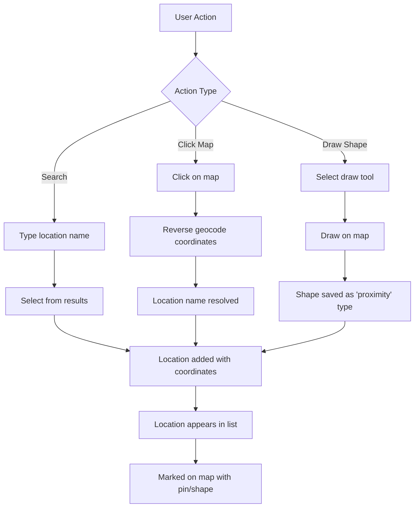

### Inclusion vs. Exclusion

Each location can be marked as:
- **Included** – Your ads CAN appear in this area
- **Excluded** – Your ads will NOT appear in this area (useful for excluding competitor locations)

> **Current Implementation:** The inclusion/exclusion toggle is stored in the data model but the UI currently defaults all selections to "included." Future enhancements will add explicit exclusion controls in the interface.

### 3D Building View

For detailed urban planning, you can enable 3D building view:
- Buildings render as 3D structures based on their actual height
- Only visible at high zoom levels (zoom 15+)
- Helps visualize billboard visibility and sight lines

### CSV Import/Export

For campaigns with many geographic targets, you can use CSV files to bulk import and export location data.

#### Import Feature

Upload a CSV file containing latitude, longitude, and radius information to quickly add multiple targeting areas:

```
┌────────────────────────────────────────────────────────────────┐
│  Import Locations from CSV                          [Upload]   │
├────────────────────────────────────────────────────────────────┤
│                                                                │
│  📄 Drop CSV file here or click to browse                     │
│                                                                │
│  Expected format:                                              │
│  latitude, longitude, radius (meters), name (optional)         │
│                                                                │
│  Example:                                                      │
│  3.1390, 101.6869, 500, Kuala Lumpur City Center              │
│  3.1570, 101.7120, 1000, Ampang Area                          │
│                                                                │
└────────────────────────────────────────────────────────────────┘
```

**CSV File Format:**

| Column | Required | Description |
|--------|----------|-------------|
| latitude | Yes | Decimal latitude (e.g., 3.1390) |
| longitude | Yes | Decimal longitude (e.g., 101.6869) |
| radius | Yes | Targeting radius in meters |
| name | No | Friendly name for the location |

**Sample CSV:**
```csv
latitude,longitude,radius,name
3.1390,101.6869,500,KLCC
3.1570,101.7120,1000,Ampang
1.2897,103.8501,750,Marina Bay
```

When you import a CSV, each row becomes a targeting circle on the map. The circles appear in the Selected Locations list on the right side of the interface.

#### Export Feature

Export your current targeting selections to CSV for:
- Backup and archiving
- Sharing with team members
- Reusing in future campaigns
- External analysis

Click **Export** to download all current locations (cities, POIs, and custom shapes) as a CSV file.

### POI Search (Points of Interest)

When you search for a location or draw a shape on the map, the system can find Points of Interest (POIs) within that area using Google Places API.

#### How POI Search Works

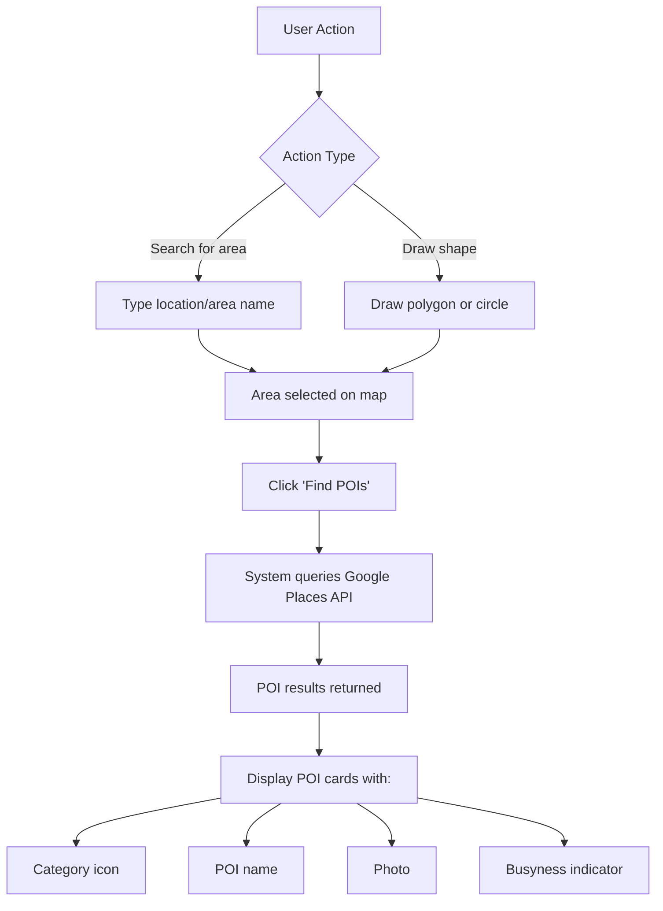

#### POI Information Returned

When you search for POIs, Google Places API returns:

| Data | Description |
|------|-------------|
| **Category** | Type of place (restaurant, shopping, entertainment, etc.) |
| **Name** | Business or place name |
| **Photo** | Image of the location |
| **Busyness** | Typical foot traffic patterns (when available) |

#### POI Category Icons

Each POI category is displayed with a distinctive icon:

| Category | Icon | Examples |
|----------|------|----------|
| **Food & Dining** | 🍽️ | Restaurants, cafes, food courts |
| **Shopping** | 🛍️ | Malls, retail stores, markets |
| **Entertainment** | 🎬 | Cinemas, theaters, amusement parks |
| **Health** | 🏥 | Hospitals, clinics, pharmacies |
| **Finance** | 🏦 | Banks, ATMs, financial services |
| **Education** | 🎓 | Schools, universities, training centers |
| **Transportation** | 🚉 | Stations, airports, bus terminals |
| **Lodging** | 🏨 | Hotels, hostels, resorts |
| **Worship** | ⛪ | Churches, mosques, temples |
| **Sports & Fitness** | 🏋️ | Gyms, stadiums, sports facilities |
| **Gas Station** | ⛽ | Fuel stations, EV charging |
| **Parking** | 🅿️ | Parking lots, garages |

*Icons shown are representative; actual icons in the interface may vary.*

#### Using POI Search

1. **Search or draw** – Enter an area name or draw a shape on the map
2. **Click "Find POIs"** – System searches for points of interest in that area
3. **Review results** – POI cards appear with category, name, photo, and busyness
4. **Select relevant POIs** – Click to add POIs to your targeting list
5. **POIs appear in list** – Selected POIs show in the right panel with the "poi" type label

> **Current Implementation:** POI search uses Google Places API to fetch location data. The number of POIs returned may be limited by API quotas. Premium categories and detailed busyness data may require additional API access.

---

## Tab 3: Signals

Signals are **real-time triggers** that can activate or modify your campaign based on external conditions. Unlike demographics and geofencing which are static definitions, signals allow your campaign to respond dynamically.

### Available Signal Types

| Signal | Description | Example Trigger |
|--------|-------------|-----------------|
| **Weather Triggers** | Activate ads based on weather conditions | Show umbrella ads when rain is forecast |
| **Search Behavior** | Target based on trending searches | Boost campaign when search interest spikes |
| **Footfall Patterns** | Respond to real-time traffic | Increase frequency during peak foot traffic |
| **Time-Based** | Show different content by time of day | Morning commute vs. evening entertainment |
| **Local Events** | Activate during specific events | Sports game days, festivals, holidays |

### Signals Tab Layout

```
┌────────────────────────────────────────────────────────────────────────────┐
│ SIGNALS TAB                                                                │
├────────────────────────────────────────────────────────────────────────────┤
│                                                                            │
│  Signals & Triggers                                                        │
│  ┌────────────────────────────────────────────────┐  ┌──────────────────┐ │
│  │ [Select signals... ▼]                          │  │ + Add New Signal │ │
│  └────────────────────────────────────────────────┘  └──────────────────┘ │
│                                                                            │
│  Signals allow you to trigger your advertisements based on real-time      │
│  factors such as weather conditions, time of day, or events.               │
│                                                                            │
│  Selected Signals:                                                         │
│  ┌────────────────────────────────────────────────────────────────────┐   │
│  │ [Weather Triggers ✕]  [Time-Based ✕]                               │   │
│  └────────────────────────────────────────────────────────────────────┘   │
│                                                                            │
└────────────────────────────────────────────────────────────────────────────┘
```

### How Signals Work

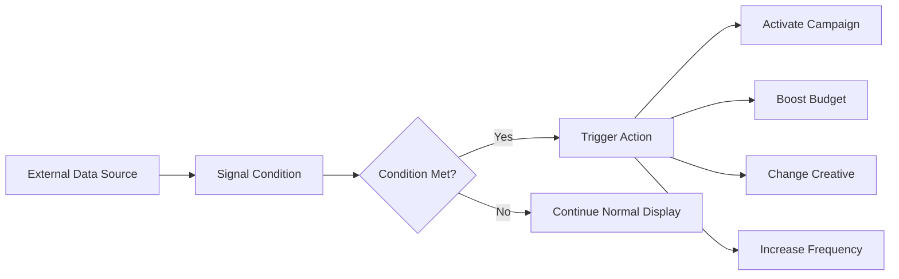

**Signal Components:**

1. **Data Source** – Where the signal data comes from (weather API, footfall sensors, search trends)
2. **Condition** – The rule that triggers the action (temperature > 30°C, footfall > 75% of max)
3. **Action** – What happens when the condition is met (activate, boost, pause, swap creative)

### Creating New Signals

Clicking "Add New Signal" opens a confirmation dialog asking if you want to save your campaign as a draft before navigating away:

```
┌─────────────────────────────────────────────────────────────────┐
│  Save Campaign Draft?                                           │
├─────────────────────────────────────────────────────────────────┤
│                                                                 │
│  You're about to navigate to the Signals page. Would you like  │
│  to save your current campaign as a draft first?               │
│                                                                 │
│                              [ Cancel ]  [ Save & Continue ]    │
└─────────────────────────────────────────────────────────────────┘
```

From the Signals Management page, you can:

1. Choose a signal type (Weather, Footfall, Audience, Location, Search Trends)
2. Configure the data source
3. Define trigger conditions and thresholds
4. Set the frequency of checking (real-time, hourly, daily, weekly)
5. Tag and save the signal for reuse

> **Note:** If you choose to navigate without saving, any unsaved campaign progress will be lost. We recommend saving as a draft before leaving the campaign wizard.

### Signal Examples

**Weather Signal – "Rainy Day Campaign"**
```
Type: Weather
Condition: precipitation > 50%
Action: Activate umbrella advertisement
Geography: Kuala Lumpur, Penang
```

**Footfall Signal – "Peak Shopping Hours"**
```
Type: Footfall
Condition: footfall_index > 75
Action: Increase ad frequency by 50%
Locations: Pavilion Mall, Suria KLCC
```

**Time-Based Signal – "Morning Commute"**
```
Type: Time-Based
Condition: time = 7:00 AM - 9:00 AM, weekdays
Action: Show breakfast-related creative
```

**Default selection:** Weather (single signal selected)

---

## How Targeting Data is Stored

When you complete Step 3, all your targeting selections are saved as part of the campaign record. Here's how the data is structured:

```json
{
  "targeting": {
    "demographics": {
      "ageGroups": ["25-34", "35-44"],
      "gender": ["male", "female"],
      "income": ["middle", "upper-middle"],
      "interests": ["technology", "fashion"]
    },
    "environment": ["retail-mall-atrium", "transit-airport-gate"],
    "audienceBehavior": ["commuters", "shoppers"],
    "signals": ["weather", "footfall"],
    "geofencing": {
      "targets": [
        {
          "id": "location-1234567890",
          "name": "Kuala Lumpur",
          "type": "city",
          "included": true,
          "coordinates": [101.6869, 3.1390]
        },
        {
          "id": "shape-1234567891",
          "name": "Custom Polygon",
          "type": "proximity",
          "included": true,
          "coordinates": [101.7100, 3.1500]
        }
      ]
    }
  }
}
```

### Targeting Schema Reference

| Field | Type | Description |
|-------|------|-------------|
| `demographics.ageGroups` | string[] | Selected age ranges (required, min 1) |
| `demographics.gender` | string[] | Selected genders |
| `demographics.income` | string[] | Selected income brackets |
| `demographics.interests` | string[] | Selected interest categories |
| `environment` | string[] | Selected venue type IDs (OpenOOH taxonomy) |
| `audienceBehavior` | string[] | Selected audience behavior patterns |
| `signals` | string[] | Selected signal types |
| `geofencing.targets` | GeoTarget[] | Geographic targets (see below) |

### GeoTarget Object Structure

Each geographic target in the `geofencing.targets` array has:

| Field | Type | Description |
|-------|------|-------------|
| `id` | string | Unique identifier (auto-generated) |
| `name` | string | Location name (from geocoding or user input) |
| `type` | enum | One of: 'country', 'region', 'city', 'poi', 'proximity' |
| `included` | boolean | true = include this area, false = exclude |
| `coordinates` | [number, number] | [longitude, latitude] for the location |
| `radius` | number (optional) | Radius in meters for proximity targeting |

---

## How Targeting Affects Inventory Selection

The targeting you define in Step 3 is used in subsequent steps:

1. **Inventory Filtering** – In Step 4 (Media Selection), inventories are filtered or scored based on:
   - Venue type matches your selected venue types
   - Location falls within your geofencing areas
   - Audience demographics match the inventory's typical audience
   
2. **Recommendations** – The system recommends inventories that align with your targeting profile

3. **Forecasting** – Impression and reach forecasts are adjusted based on targeting narrowness

4. **Reporting** – After campaign execution, reports show performance broken down by targeting segments

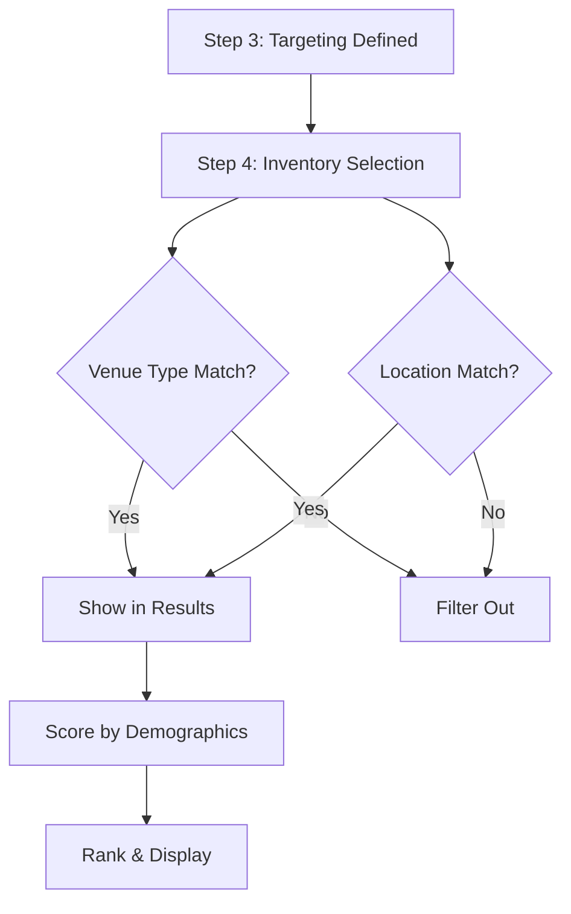

---

## Targeting Best Practices

### Do's

1. **Start with recommendations** – Apply the AI recommendations as a starting point, then adjust
2. **Balance specificity** – More targeting = more relevance, but less reach
3. **Use venue hierarchy wisely** – Select at the right level (category for broad, product for specific)
4. **Draw conservative geofences** – Larger areas give more flexibility for inventory matching
5. **Test signals before launch** – Ensure signal conditions will actually trigger during your campaign

### Don'ts

1. **Don't over-target** – Selecting too many narrow criteria can eliminate most inventory
2. **Don't forget mobile audiences** – Transit and outdoor venues capture people on the move
3. **Don't ignore income relevance** – Match income targeting to product price point
4. **Don't set impossible signals** – A "snow in Malaysia" trigger will never fire

### Targeting by Campaign Goal

| Goal | Recommended Targeting Approach |
|------|-------------------------------|
| **Impressions** | Broader targeting, high-traffic venues, multiple locations |
| **Reach** | Diverse venue types, spread across cities, all demographics |
| **Share of Voice** | Focused locations, competitor-adjacent venues, premium positions |

---

## Validation Requirements

Step 3 has one validation requirement:

| Field | Requirement | Error Message |
|-------|-------------|---------------|
| Age Groups | At least 1 selection | "Select at least one age group" |

All other fields are optional but selecting more targeting options improves campaign relevance.

---

## Step 3 Form Summary

| Tab | Field | Required | Default |
|-----|-------|----------|---------|
| Demographics | Age Groups | Yes (min 1) | 25-34, 35-44 |
| Demographics | Gender | No | Male, Female |
| Demographics | Income Brackets | No | Middle, Upper-middle |
| Demographics | Interests | No | Technology, Fashion |
| Demographics | Venue Types | No | Urban, Retail |
| Demographics | Audience Behavior | No | Commuters, Shoppers |
| Geofencing | Location Targets | No | None |
| Geofencing | Custom Areas | No | None |
| Signals | Signal Types | No | Weather |

---

## What Happens Next

After completing Step 3, you'll move to Step 4: Media Selection, where you'll:

- Browse and search for specific advertising spaces (inventories)
- View inventory locations on an interactive map
- Check availability for your campaign dates
- Add individual inventories to your campaign
- See how each inventory matches your targeting criteria

The targeting you defined filters and ranks the inventory shown, helping you find the most relevant advertising spaces for your campaign.

---


# Step 4: Media Selection

Step 4 is where you **shop for advertising spaces**. Think of it like browsing a catalog of billboards, digital screens, and other outdoor advertising locations. You'll search, filter, preview, and add the ones you want to your campaign.

This is one of the most interactive steps – you'll spend time exploring different options, checking if they're available during your campaign dates, and building your media plan.

## What is Inventory?

In outdoor advertising, "inventory" means **advertising spaces that are available for booking**. Each inventory item is a physical location where your ad can appear:

- A **billboard** on a highway
- A **digital screen** in a shopping mall
- A **poster** at a bus stop
- A **video wall** in a train station

The system shows you all the advertising spaces that match your campaign's country and targeting preferences.

## Overview

```
┌────────────────────────────────────────────────────────────────────────────┐
│                        STEP 4: MEDIA SELECTION                             │
├────────────────────────────────────────────────────────────────────────────┤
│                                                                            │
│  ┌─────────────────────────────────────────┐  ┌────────────────────────┐  │
│  │                                         │  │                        │  │
│  │           AVAILABLE INVENTORY           │  │    YOUR SELECTIONS     │  │
│  │                                         │  │                        │  │
│  │  🔍 Search...           [Filters]       │  │  📊 Campaign Forecast  │  │
│  │  ─────────────────────────────────────  │  │                        │  │
│  │                                         │  │  Impressions: 2.4M     │  │
│  │  ☐ Billboard - KLCC              ➕    │  │  Reach: 890,000        │  │
│  │  ☐ Digital Screen - Pavilion     ➕    │  │  Cost: 45,000 MYR      │  │
│  │  ☑ LED Display - MidValley       ✓     │  │                        │  │
│  │  ☐ Transit Poster - KL Sentral   ➕    │  │  ────────────────────  │  │
│  │                                         │  │                        │  │
│  │  [View on Map]    [Check Availability]  │  │  Selected: 3 items     │  │
│  │                                         │  │  [View All] [Clear]    │  │
│  └─────────────────────────────────────────┘  └────────────────────────┘  │
│                                                                            │
│                                             [ Save Draft ] [ Continue → ]  │
└────────────────────────────────────────────────────────────────────────────┘
```

## The Two-Panel Layout

Step 4 uses a split-screen design:

| Left Panel | Right Panel |
|------------|-------------|
| Browse available inventory | See what you've selected |
| Search and filter options | View campaign forecast |
| Add items to your campaign | Manage your selections |

This layout lets you shop for advertising spaces while keeping track of your campaign's projected performance.

---

## Browsing Available Inventory

### The Inventory List

Each advertising space appears as a row with key information at a glance:

```
┌──────────────────────────────────────────────────────────────────────────┐
│ ☐  [📷]  Digital Billboard - Jalan Bukit Bintang                        │
│           📍 Kuala Lumpur, Bukit Bintang                                 │
│           🏢 Media Owner: Prime Outdoor Sdn Bhd                          │
│           📐 Large format  •  🖥️ Digital  •  💰 15,000 MYR/month        │
│                                                                          │
│     [📍 View on Map]  [📅 Check Availability]  [👁️ Details]  [➕ Add]   │
└──────────────────────────────────────────────────────────────────────────┘
```

**What each piece of information means:**

| Element | Description |
|---------|-------------|
| **Checkbox** | Select multiple items for bulk actions |
| **Photo thumbnail** | A picture of the advertising space |
| **Name** | What the inventory is called (often includes location) |
| **Location** | City and neighborhood where it's located |
| **Media Owner** | The company that owns this advertising space |
| **Format** | Size category (small, medium, large, extra-large) |
| **Type** | Digital screen, static billboard, transit, etc. |
| **Price** | Monthly cost for this advertising space |

### Search Bar

Type any keyword to find specific inventory:

- **Location names**: "Bukit Bintang", "KLCC", "Penang"
- **Inventory names**: "LED Wall", "Bus Shelter"
- **Media owner names**: "Prime Outdoor", "Big Tree"

The list updates instantly as you type.

### Filters

Click the **Filters** button to narrow down options. Available filters include:

**Location Filters**
- Country (already set from Step 2)
- State or region
- City
- District or neighborhood

**Inventory Filters**
- Type: Billboard, Digital, Transit, Street Furniture
- Format: Small, Medium, Large, Extra-Large
- Media Owner: Select specific companies

**Availability Filters**
- Show only available during my campaign dates
- Show all (including partially booked)

> **Tip:** The more filters you apply, the fewer results you'll see. Start broad and narrow down gradually.

---

## Viewing Inventory Details

Before adding an inventory to your campaign, you'll want to learn more about it. There are several ways to explore:

### Quick Preview

Hover over any inventory row to see a popup with:
- Larger photo
- Key metrics (impressions, reach)
- Availability status

### Full Details Panel

Click **Details** or the inventory name to open a side panel with comprehensive information:

```
┌────────────────────────────────────────────────────────────┐
│  Digital Billboard - Jalan Bukit Bintang              [✕]  │
├────────────────────────────────────────────────────────────┤
│                                                            │
│  ┌─────────────────────────────────────────────────────┐  │
│  │                                                     │  │
│  │              [Photo of Billboard]                   │  │
│  │                                                     │  │
│  └─────────────────────────────────────────────────────┘  │
│                                                            │
│  📍 Location                                               │
│  Jalan Bukit Bintang, Kuala Lumpur                        │
│  Opposite Pavilion Mall entrance                           │
│                                                            │
│  📊 Estimated Performance (Monthly)                        │
│  ┌──────────────┬──────────────┬──────────────┐           │
│  │ Impressions  │    Reach     │   Ad Plays   │           │
│  │   450,000    │   180,000    │    8,640     │           │
│  └──────────────┴──────────────┴──────────────┘           │
│                                                            │
│  🖥️ Screen Specifications                                 │
│  • Size: 10m x 5m (Large format)                          │
│  • Type: LED Digital                                       │
│  • Resolution: 1920 x 1080                                │
│  • Operating hours: 6:00 AM - 12:00 AM                    │
│                                                            │
│  💰 Pricing                                                │
│  Rate card: 15,000 MYR/month                              │
│  eCPM: 33.33 MYR                                          │
│                                                            │
│  🏢 Media Owner                                            │
│  Prime Outdoor Sdn Bhd                                     │
│                                                            │
│            [📍 View on Map]  [📅 Availability]  [➕ Add]   │
└────────────────────────────────────────────────────────────┘
```

**Understanding the metrics:**

| Metric | What It Means | Analogy |
|--------|---------------|---------|
| **Impressions** | How many times your ad will be seen | Like "page views" for a website |
| **Reach** | How many different people will see it | The unique audience size |
| **Ad Plays** | How many times your ad will display | For digital screens that rotate ads |
| **eCPM** | Cost per 1,000 impressions | Helps compare value across different inventory |

---

## View on Map

Click **View on Map** to see exactly where an advertising space is located. The map opens in a popup showing:

- A pin marking the exact location
- Nearby landmarks and streets
- The direction the billboard faces
- Other inventory nearby (if available)

```
┌────────────────────────────────────────────────────────────┐
│  Inventory Location                                   [✕]  │
├────────────────────────────────────────────────────────────┤
│                                                            │
│      ╔═══════════════════════════════════════════╗        │
│      ║                                           ║        │
│      ║        [Interactive Map View]             ║        │
│      ║                                           ║        │
│      ║              📍 Billboard                 ║        │
│      ║               Location                    ║        │
│      ║                                           ║        │
│      ║     ← Traffic flow direction              ║        │
│      ║                                           ║        │
│      ╚═══════════════════════════════════════════╝        │
│                                                            │
│  🗺️ Map controls: Zoom in/out, Street/Satellite view      │
│                                                            │
└────────────────────────────────────────────────────────────┘
```

**Why location matters:**
- **Traffic flow**: Is the billboard facing oncoming traffic?
- **Visibility**: Are there trees or buildings blocking the view?
- **Nearby businesses**: Is it near relevant shops or venues?
- **Audience**: What kind of people pass by this location?

---

## Check Availability

Before adding inventory to your campaign, check if it's available during your campaign dates.

Click **Check Availability** to see the calendar:

```
┌────────────────────────────────────────────────────────────┐
│  Availability Calendar                                [✕]  │
├────────────────────────────────────────────────────────────┤
│                                                            │
│  Digital Billboard - Jalan Bukit Bintang                  │
│                                                            │
│  December 2025                                             │
│  ┌─────┬─────┬─────┬─────┬─────┬─────┬─────┐              │
│  │ Sun │ Mon │ Tue │ Wed │ Thu │ Fri │ Sat │              │
│  ├─────┼─────┼─────┼─────┼─────┼─────┼─────┤              │
│  │     │  1  │  2  │  3  │  4  │  5  │  6  │              │
│  │     │ 🟢  │ 🟢  │ 🟢  │ 🟡  │ 🟡  │ 🟢  │              │
│  ├─────┼─────┼─────┼─────┼─────┼─────┼─────┤              │
│  │  7  │  8  │  9  │ 10  │ 11  │ 12  │ 13  │              │
│  │ 🔴  │ 🔴  │ 🔴  │ 🔴  │ 🔴  │ 🔴  │ 🔴  │              │
│  ├─────┼─────┼─────┼─────┼─────┼─────┼─────┤              │
│  │ 14  │ 15  │ 16  │ 17  │ 18  │ 19  │ 20  │              │
│  │ 🟢  │ 🟢  │ 🟢  │ 🟢  │ 🟢  │ 🟢  │ 🟢  │              │
│  └─────┴─────┴─────┴─────┴─────┴─────┴─────┘              │
│                                                            │
│  Legend:  🟢 Available   🟡 Partial   🔴 Booked           │
│                                                            │
│  Your campaign: Dec 15 - Jan 15                           │
│  Status: ✓ Available for your dates                       │
│                                                            │
└────────────────────────────────────────────────────────────┘
```

**Availability colors:**

| Color | Meaning |
|-------|---------|
| 🟢 **Green** | Fully available – you can book 100% of this date |
| 🟡 **Yellow** | Partially available – some time slots are booked |
| 🔴 **Red** | Fully booked – another advertiser has this date |

> **Note:** If your campaign dates overlap with red dates, you may need to adjust your dates or choose different inventory.

---

## Adding Inventory to Your Campaign

When you find inventory you want, click the **Add** button (➕) to include it in your campaign. The inventory moves to your selections panel on the right.

### Your Selections Panel

As you add inventory, the right panel updates to show:

```
┌─────────────────────────────────────────┐
│  YOUR SELECTIONS                    (3) │
├─────────────────────────────────────────┤
│                                         │
│  📊 Campaign Forecast                   │
│  ─────────────────────────────────────  │
│                                         │
│  Impressions      2,400,000             │
│  Reach              890,000             │
│  Ad Plays            25,920             │
│  Avg. Frequency         2.7             │
│                                         │
│  ─────────────────────────────────────  │
│                                         │
│  💰 Estimated Cost                      │
│  Total: 45,000 MYR                      │
│  eCPM: 18.75 MYR                        │
│                                         │
│  ─────────────────────────────────────  │
│                                         │
│  Selected Inventory:                    │
│                                         │
│  1. Digital Billboard - Bukit Bintang   │
│     15,000 MYR  •  450K impressions     │
│                              [Remove]   │
│                                         │
│  2. LED Screen - Pavilion Mall          │
│     12,000 MYR  •  380K impressions     │
│                              [Remove]   │
│                                         │
│  3. Transit Poster - KL Sentral         │
│     18,000 MYR  •  520K impressions     │
│                              [Remove]   │
│                                         │
│  ─────────────────────────────────────  │
│                                         │
│  [View All on Map]  [View Availability] │
│                                         │
└─────────────────────────────────────────┘
```

### Understanding the Forecast

The forecast updates automatically as you add or remove inventory:

| Metric | What It Tells You |
|--------|-------------------|
| **Impressions** | Total times your ad will be seen across all selected inventory |
| **Reach** | Estimated unique people who will see your campaign |
| **Ad Plays** | Total number of times your ad will display (digital only) |
| **Avg. Frequency** | On average, how many times each person will see your ad |
| **Total Cost** | Combined price of all selected inventory |
| **eCPM** | Average cost per 1,000 impressions (lower is more efficient) |

> **Tip:** Watch the forecast as you add inventory. If you're trying to reach a specific impression goal (from Step 2), you can see how close you're getting.

---

## Share of Voice (SOV)

For digital screens that rotate multiple ads, you can control how much of the airtime your ad gets. This is called **Share of Voice**.

When you add digital inventory, a slider appears:

```
┌───────────────────────────────────────────────────────────┐
│  LED Screen - Pavilion Mall                               │
│                                                           │
│  Share of Voice: 25%                                      │
│  ◀────────●────────────────────────────────────────────▶  │
│    10%                                              100%  │
│                                                           │
│  At 25% SOV:                                              │
│  • Your ad plays 25% of the time                          │
│  • Impressions: 95,000 (of 380,000 total)                │
│  • Cost: 3,000 MYR (of 12,000 full rate)                 │
└───────────────────────────────────────────────────────────┘
```

**How SOV works:**

| SOV | What It Means | When to Use |
|-----|---------------|-------------|
| **10-25%** | Your ad shares the screen with several others | Budget-conscious, broad awareness |
| **50%** | Your ad plays half the time | Balanced approach |
| **100%** | Your ad is the only one on this screen | Maximum impact, premium pricing |

> **Analogy:** Think of SOV like buying ad time on TV. 25% SOV means your commercial plays for 15 seconds of every minute; 100% means you own the entire minute.

---

## Bulk Actions

When working with many inventory items, you can select multiple at once:

1. Click the checkboxes next to several items
2. Click **Bulk Actions**
3. Choose an action:
   - **Add All Selected** – Add all checked items to your campaign
   - **View on Map** – See all selected locations on one map
   - **Export List** – Download details as a spreadsheet

---

## What Different Users See

### Media Owners

When you're a media owner creating a campaign:
- You see **only your own inventory** by default
- Toggle "Show All Inventory" to see competitor options
- Your inventory appears highlighted with a "Your Inventory" badge

### Agencies and Advertisers

When you're an agency or advertiser:
- You see inventory from **all media owners** in your selected country
- You can filter by specific media owners if you have preferences
- Pricing shown is the rate card price (negotiation happens later)

### Internal Users

Internal users see:
- All inventory across all media owners
- Special admin options like inventory status
- Cost and margin information

---

## Tips for Selecting Inventory

### Do

✓ **Start with your target audience** – Choose inventory where your target customers are likely to be

✓ **Check availability early** – Popular locations book up quickly, especially during holidays

✓ **Mix formats** – Combine different types (billboard + transit + digital) for broader reach

✓ **Consider the journey** – Select inventory along routes your audience travels

✓ **Watch your budget** – Keep an eye on the total cost as you add items

### Don't

✗ **Don't over-select** – Quality matters more than quantity

✗ **Don't ignore location** – A cheaper billboard in a bad location isn't a good deal

✗ **Don't forget timing** – Make sure all inventory is available for your full campaign period

✗ **Don't skip the preview** – Always look at photos and map locations before adding

---

## Common Questions

**Q: What if the inventory I want is already booked?**
A: You have options: adjust your campaign dates, choose nearby alternative inventory, or contact the media owner to discuss availability.

**Q: Can I add inventory from multiple media owners?**
A: Yes! You can mix and match from different media owners. The system handles this automatically.

**Q: How accurate are the impression numbers?**
A: Impression estimates are based on traffic data for each location. They're projections, not guarantees, but they give you a reliable comparison between options.

**Q: What happens after I select inventory?**
A: In the next step (Optimization), you'll fine-tune scheduling and budget allocation. The inventory isn't "booked" until later in the approval process.

---

## Validation

Step 4 has one requirement:

| Field | Requirement | Error Message |
|-------|-------------|---------------|
| Selected Inventory | At least 1 item | "Please select at least one inventory item" |

---

## Step 4 Summary

| Element | Purpose |
|---------|---------|
| **Search** | Find specific inventory by name or location |
| **Filters** | Narrow down by type, format, media owner |
| **Details** | View complete information about each inventory |
| **Map View** | See exact location and surroundings |
| **Availability** | Check if dates are open for booking |
| **SOV Slider** | Control airtime share for digital screens |
| **Forecast** | See projected campaign performance |

---

## What Happens Next

After completing Step 4, you'll move to Step 5: Optimization.

---

# Step 5: Optimization

Step 5 is where you **fine-tune when and how your ads will play**. Think of it like setting a schedule for your advertisements – you decide which days, which hours, and how your budget is spread across different types of advertising spaces.

This step is marked as **Optional** – you can skip it and the system will use default settings, or you can customize everything to match your campaign strategy.

## Overview

```
┌────────────────────────────────────────────────────────────────────────────────┐
│  Create new campaign                           [ Save as Draft ] [ Finalise ] │
├────────────────────────────────────────────────────────────────────────────────┤
│                                                                                │
│  ✓ Campaign Details ─── ✓ Budgeting ─── ✓ Targeting ─── ✓ Inventories ─── ⑤ Optimisation │
│                                                                   (Optional)  │
├────────────────────────────────────────────────────────────────────────────────┤
│                                                                                │
│  ┌──────────────────────────────────────────────┐  ┌────────────────────────┐ │
│  │  📊 Budget Distribution                      │  │  Campaign Forecast     │ │
│  │  Adjust your budget across inventory types   │  │                        │ │
│  │                                              │  │  Est. Impressions      │ │
│  │  Digital  ────●───────────── 25%            │  │       870,000          │ │
│  │  Transit  ────●───────────── 25%            │  │                        │ │
│  │  Classic  ────●───────────── 25%            │  │  Est. Reach            │ │
│  │  Retail   ────●───────────── 25%            │  │       522,000          │ │
│  └──────────────────────────────────────────────┘  │                        │ │
│                                                     │  Avg. Frequency        │ │
│  ┌──────────────────────────────────────────────┐  │       2.4              │ │
│  │  🕐 Inventory-Specific Scheduling            │  │                        │ │
│  │  Set custom schedules and operating hours    │  │  Est. Ad Plays         │ │
│  │                                              │  │       1,813            │ │
│  │  [ Optimise Manually ]  [ ✨ AI Optimisation ]│  │                        │ │
│  └──────────────────────────────────────────────┘  │  SOV %: 12.5%          │ │
│                                                     │  SOT %: 24.5%          │ │
│  ┌─────────────────────┐ ┌────────────────────┐   │                        │ │
│  │  Inventories        │ │  Schedule (1 of 2) │   │  Avg. CPM: USD 15      │ │
│  │  List of selected   │ │  ────────────────  │   │                        │ │
│  │                     │ │  Dates: Nov 20-24  │   └────────────────────────┘ │
│  │  ☑ Billboard #1     │ │  Days: Mon-Sun     │                              │
│  │  ☑ LED Screen #2    │ │  Duration: 15 sec  │                              │
│  │  ☑ Transit #3       │ │  Spots/Hour: 120   │                              │
│  │  ...                │ │  Play Hours: 12    │                              │ │
│  └─────────────────────┘ └────────────────────┘                              │
│                                                                                │
│                                                           [ < Previous Step ] │
└────────────────────────────────────────────────────────────────────────────────┘
```

## The Three Main Sections

Step 5 has three key areas you can adjust:

| Section | Purpose | Required? |
|---------|---------|-----------|
| **Budget Distribution** | Spread your budget across inventory types | Optional |
| **Inventory Scheduling** | Set when your ads play | Optional |
| **Campaign Forecast** | See projected performance | View only |

---

## Budget Distribution

This section shows sliders for each type of inventory in your campaign. By default, the budget is split equally.

```
┌─────────────────────────────────────────────────────────────────────────┐
│  📊 Budget Distribution                                                 │
│  Adjust your budget across inventory types                              │
│                                                                         │
│  ⓘ Inventory types include both individual assets and networks         │
│                                                                         │
│  Digital   ──────────●──────────────────────────────────  25%          │
│                                                                         │
│  Transit   ──────────●──────────────────────────────────  25%          │
│                                                                         │
│  Classic   ──────────●──────────────────────────────────  25%          │
│                                                                         │
│  Retail    ──────────●──────────────────────────────────  25%          │
└─────────────────────────────────────────────────────────────────────────┘
```

### How Budget Distribution Works

Drag any slider to change how much of your budget goes to that inventory type:

- **Increase one** → Others automatically decrease to keep total at 100%
- **Decrease one** → Others automatically increase

**Example:**
If you want to focus on digital screens, drag Digital to 50%. The other three types will adjust to split the remaining 50%.

### Inventory Types Explained

| Type | Description | Examples |
|------|-------------|----------|
| **Digital** | Electronic screens that display your ad | LED billboards, mall displays, video walls |
| **Transit** | Advertising in transportation areas | Bus stops, train stations, airport terminals |
| **Classic** | Traditional static billboards | Highway billboards, building wraps |
| **Retail** | Advertising in shopping environments | Mall atriums, store windows, shopping corridors |

> **Note:** The types shown depend on what inventory you selected in Step 4. If you only selected digital screens, you won't see sliders for other types.

---

## Inventory-Specific Scheduling

This is where you control **when your ads play** on each advertising space. You have two options:

| Option | Best For |
|--------|----------|
| **Optimise Manually** | Full control over exact hours and days |
| **AI Optimisation** | Let the system recommend the best schedule |

### Understanding the Scheduling Area

Below the buttons, you'll see:

```
┌─────────────────────────────────────┐  ┌─────────────────────────────────────┐
│  Inventories                        │  │  Schedule (1 of 2)            [+][✏][🗑] │
│  List of all selected inventories   │  │                                     │
│                                     │  │  Schedule Dates   20 Nov - 24 Nov   │
│  [ All Inventories         ▼ ]      │  │  Schedule Days    Mon Tue Wed...    │
│                                     │  │  Duration         15 Seconds        │
│  ┌─────────────────────────────┐   │  │  Spots/Loop       2                 │
│  │ Billboard - Jalan Bukit...  │   │  │  Spots/Hour       120               │
│  │ [Digital][Retail][Medium]   │   │  │  Play Hours/Day   12                │
│  │             10AM to 10PM 🕐 │   │  │                                     │
│  └─────────────────────────────┘   │  └─────────────────────────────────────┘
│  ┌─────────────────────────────┐   │
│  │ LED Screen - Pavilion Mall  │   │
│  │ [Classic][Retail][Medium]   │   │
│  │                    24/7  🕐 │   │
│  └─────────────────────────────┘   │
└─────────────────────────────────────┘
```

**Left panel (Inventories):** Lists all the advertising spaces you selected in Step 4. Each shows:
- Name of the inventory
- Tags indicating type (Digital/Classic), venue (Retail/Outdoor), size (Medium)
- Operating hours (e.g., "10AM to 10PM" or "24/7")

**Right panel (Schedule):** Shows the schedule details for the selected inventory:
- **Schedule Dates** – Which dates the schedule applies to
- **Schedule Days** – Which days of the week
- **Duration** – How long each ad plays (in seconds)
- **Spots/Loop** – How many times your ad plays per rotation
- **Spots/Hour** – Total plays per hour
- **Play Hours/Day** – Hours the screen operates daily

### Multiple Schedules

An inventory can have **more than one schedule**. The dropdown shows "Schedule (1 of 2)" when multiple schedules exist.

**Why use multiple schedules?**

| Scenario | Example |
|----------|---------|
| **Different periods** | Schedule 1: Nov 20-24 (weekdays), Schedule 2: Nov 25-30 (weekend) |
| **Different day patterns** | Schedule 1: Commuter hours (7-9AM, 5-7PM), Schedule 2: Lunch hours (12-2PM) |
| **Promotional periods** | Schedule 1: Regular run, Schedule 2: Black Friday special |

Use the buttons to manage schedules:
- **[+]** Add a new schedule
- **[✏]** Edit the current schedule
- **[🗑]** Delete the current schedule

---

## Optimise Manually (The Schedule Grid)

Clicking **"Optimise Manually"** opens a detailed scheduling dialog where you can pick exact hours and days for your ads to play.

```
┌────────────────────────────────────────────────────────────────────────────────┐
│  Optimise Manually                                                        [✕] │
├────────────────────────────────────────────────────────────────────────────────┤
│                                                                                │
│  Selected Inventories          │  Optimise Schedule                           │
│  ─────────────────────────────│  ─────────────────────────────────────────── │
│  🔍 Search added locations...  │                                              │
│                                │  Schedule Date                               │
│  ☑ Select all            5/5  │  [ 12 Nov 2025 - 24 Nov 2025        📅 ]     │
│                                │                                              │
│  ☑ Billboard - Jalan Bukit... │  Select days of schedule  ☑ Select all days  │
│    [Digital][Retail] 10AM-10PM │  [Mon][Tue][Wed][Thu][Fri][Sat][Sun]         │
│                          ⚠    │                                              │
│  ☑ LED Screen - Pavilion      │  Schedule Grids                              │
│    [Classic][Retail]     24/7  │  ○ Select All  ○ Deselect All  [ Custom ▼ ] │
│                                │                                              │
│  ☑ Transit - KL Sentral       │  Date/Hours  0 1 2 3 4 5 6 7 8 ... 17 18 19  │
│    [Digital][Outdoor] 2AM-11PM │  ─────────────────────────────────────────── │
│                          ⚠    │  12 Nov (Mon) ░░░░░░░█████████████████████   │
│  ☑ Digital - MidValley        │  13 Nov (Tue) ░░░░░░░█████████████████████   │
│    [Digital][Retail] 6AM-11PM  │  14 Nov (Wed) ░░░░░░░█████████████████████   │
│                          ⚠    │  15 Nov (Thu) ░░░░░░░█████████████████████   │
│  ☑ Billboard - Suria          │  16 Nov (Fri) ░░░░░░░█████████████████████   │
│    [Digital][Retail] 10AM-10PM │  17 Nov (Sat) ███████████████████████████   │
│                          ⚠    │  18 Nov (Sun) ███████████████████████████   │
│                                │  ...                                         │
│                                │                                              │
│                                │  ▓▓▓▓▓▓▓▓▓▓▓░░░░░░░░░░░░░░░░░░░░░░░░░░░░░   │
│                                │  Most Overlapped          Least Overlapped   │
│                                │                                              │
│  ☑ Clear the previous schedule/s of selected billboards                      │
│                                                                                │
│                                          [ Cancel ]  [ Save Changes ]         │
└────────────────────────────────────────────────────────────────────────────────┘
```

### Left Panel: Selecting Inventories

The left side shows all your selected inventory. You can:

- **Search** – Find specific items by name
- **Select All** – Apply the same schedule to everything
- **Individual selection** – Check/uncheck specific items

**The Warning Icon (⚠):** Appears when an inventory has operating hour restrictions. For example, if a billboard only operates 10AM-10PM, and you try to schedule ads at 6AM, you'll see this warning.

### Right Panel: The Schedule Grid

This is where the magic happens. The grid shows:

- **Rows** = Each day in your campaign period
- **Columns** = Hours of the day (0-23, or 12AM to 11PM)
- **Cells** = Click to select/deselect that hour on that day

**Color coding:**

| Color | Meaning |
|-------|---------|
| **Dark blue** | Most overlapped – This hour is scheduled for most selected inventories |
| **Light blue** | Least overlapped – This hour is scheduled for fewer inventories |
| **White/Empty** | Not scheduled |

### Quick Selection Options

Instead of clicking individual cells, use these shortcuts:

**Day Selection:**
- Click day buttons (Mon, Tue, Wed...) to include/exclude entire days
- "Select all days" checkbox to schedule every day

**Grid Presets (Custom dropdown):**

| Preset | What It Selects |
|--------|-----------------|
| **Commuter** | 7-9 AM and 5-7 PM on weekdays |
| **Nightlife** | 8 PM - 2 AM, heavier on weekends |
| **Business Hours** | 9 AM - 6 PM, weekdays only |
| **Weekend** | All hours on Saturday and Sunday |
| **24/7** | All hours, every day |

**Grid-wide options:**
- **Select All** – Fill every cell
- **Deselect All** – Clear the entire grid

### Clear Previous Schedules

At the bottom, there's a checkbox: **"Clear the previous schedule/s of selected billboards"**

- ☑ **Checked:** Replace any existing schedules with this new one
- ☐ **Unchecked:** Add this as an additional schedule (keeps existing ones)

---

## AI Optimisation

Clicking **"AI Optimisation"** lets the system suggest the best schedule based on:

- Your campaign goals (impressions, reach, or share of voice)
- Historical performance data for each inventory
- Traffic patterns and audience behavior
- Your budget and timeline

The AI considers factors like:
- When foot traffic is highest at each location
- Which hours have the best engagement rates
- How to maximize reach across your target audience

After the AI generates recommendations, you can:
- **Accept all** – Use the suggested schedule as-is
- **Review and modify** – See the suggestions and make adjustments
- **Cancel** – Go back to manual optimization

---

## Operating Hours and Warnings

Each inventory has **operating hours** – the times when the screen or billboard is actually on and displaying ads.

```
┌──────────────────────────────────────────────────────┐
│  Billboard - Jalan Bukit Bintang                     │
│  [Digital] [Retail] [Medium]         10AM to 10PM 🕐 │
└──────────────────────────────────────────────────────┘
```

**What the time badge means:**

| Badge | Meaning |
|-------|---------|
| **24/7** | Operates all day, every day |
| **10AM to 10PM** | Only operates during those hours |
| **6AM to 11PM** | Extended hours but not overnight |

### The Warning System

When you try to schedule ads outside an inventory's operating hours, the system warns you:

```
⚠ Warning: The selected hours include times outside operating hours

Billboard "Jalan Bukit Bintang" operates 10AM-10PM
Your schedule includes hours 6AM-10AM which won't play.

[ Adjust Schedule ]  [ Continue Anyway ]
```

**What happens if you continue anyway?**

Your ad simply won't play during the off hours. The system will only display your ad when the screen is actually operating.

---

## Scheduling Scenarios

Here are common scheduling scenarios and how to set them up:

### Scenario 1: Run Ads All Day, Every Day

**Goal:** Maximum exposure, 24/7

**Steps:**
1. Click "Optimise Manually"
2. Select all inventories
3. Click "Select all days"
4. Click "Select All" in Schedule Grids
5. Save Changes

> **Note:** Some inventories don't operate 24/7, so you'll see warnings for those.

---

### Scenario 2: Weekdays Only, Business Hours

**Goal:** Target office workers during work hours

**Steps:**
1. Click "Optimise Manually"
2. Select relevant inventories
3. Turn ON: Mon, Tue, Wed, Thu, Fri
4. Turn OFF: Sat, Sun
5. Choose "Business Hours" from the Custom dropdown
6. Save Changes

---

### Scenario 3: Morning and Evening Commute

**Goal:** Catch people traveling to and from work

**Steps:**
1. Click "Optimise Manually"
2. Select inventories near transit hubs
3. Turn ON: Mon, Tue, Wed, Thu, Fri
4. Choose "Commuter" from the Custom dropdown
5. Save Changes

This selects hours 7-9 AM and 5-7 PM automatically.

---

### Scenario 4: Weekend Shopping Hours

**Goal:** Reach shoppers during peak mall hours

**Steps:**
1. Click "Optimise Manually"
2. Select retail/mall inventories
3. Turn ON: Sat, Sun only
4. Manually select hours 10 AM - 9 PM
5. Save Changes

---

### Scenario 5: Different Schedules for Different Locations

**Goal:** Some billboards run morning, others run evening

**Steps:**

**First, set morning schedule:**
1. Click "Optimise Manually"
2. Select only the morning-appropriate inventories
3. Set schedule for 6 AM - 12 PM
4. Save Changes

**Then, set evening schedule:**
1. Click "Optimise Manually" again
2. Select only the evening-appropriate inventories
3. Set schedule for 5 PM - 11 PM
4. Save Changes

---

### Scenario 6: Two Schedules on the Same Inventory

**Goal:** Run ads during commute hours AND lunch hour on the same billboard

**Steps:**
1. Select the inventory
2. First schedule: Set commuter hours (7-9 AM, 5-7 PM)
3. Save Changes
4. Click [+] to add new schedule
5. Second schedule: Set lunch hours (12-2 PM)
6. Save Changes

The inventory now has "Schedule (1 of 2)" and "Schedule (2 of 2)".

---

## Campaign Forecast Panel

The right side of the screen shows live projections based on your selections:

```
┌────────────────────────────────┐
│  Campaign Forecast             │
├────────────────────────────────┤
│  Est. Impressions    870,000   │
│  Est. Reach          522,000   │
│  Avg. Frequency         2.4    │
│  Est. Ad Plays        1,813    │
│  SOV %                12.5%    │
│  Avg. CPM            USD 15    │
│  Avg eCPM               -      │
│  Total Cost             -      │
│  ────────────────────────────  │
│  SOV %             870,000     │
│  SOT %     ████░░░░░░  24.5%   │
└────────────────────────────────┘
```

### Understanding the Metrics

| Metric | What It Means | How It Changes |
|--------|---------------|----------------|
| **Est. Impressions** | Total times your ad will be seen | More hours scheduled = more impressions |
| **Est. Reach** | Unique people who will see your ad | More locations = more reach |
| **Avg. Frequency** | Times each person sees your ad on average | Longer schedules = higher frequency |
| **Est. Ad Plays** | Number of times ad will display | Based on schedule and spots/hour |
| **SOV %** | Your share of voice | Depends on schedule density |
| **Avg. CPM** | Cost per 1,000 impressions | Changes with budget distribution |
| **SOT %** | Share of time your ad is showing | Progress bar shows percentage |

The forecast updates automatically as you:
- Adjust budget distribution sliders
- Change inventory schedules
- Add or remove inventories

---

## Tips for Optimization

### Do

✓ **Match schedule to audience** – Commuter routes need commuter hours

✓ **Check operating hours** – Don't schedule outside when screens are on

✓ **Use presets** – Start with a preset, then customize

✓ **Review the forecast** – Make sure projections meet your goals

✓ **Consider multiple schedules** – Different patterns for different purposes

### Don't

✗ **Don't schedule everything 24/7** – Unless you really need overnight coverage

✗ **Don't ignore warnings** – They're telling you something won't work as expected

✗ **Don't over-complicate** – Simple schedules are easier to manage

✗ **Don't skip checking the forecast** – It tells you if your schedule makes sense

---

## Validation

Step 5 is **optional** – there are no required fields. If you don't make any changes, the system uses default settings:

- Budget split equally across inventory types
- Schedules based on each inventory's operating hours
- Maximum available hours selected

---

## Step 5 Summary

| Element | Purpose |
|---------|---------|
| **Budget Distribution** | Allocate budget across inventory types |
| **Optimise Manually** | Detailed hour-by-hour scheduling grid |
| **AI Optimisation** | Automated schedule recommendations |
| **Multiple Schedules** | Different patterns for the same inventory |
| **Operating Hours** | Respect when screens are actually on |
| **Campaign Forecast** | Live projection of campaign performance |

---

## Finishing Your Campaign

After completing Step 5 (or skipping it), you have two options:

| Button | What It Does |
|--------|--------------|
| **Save as Draft** | Saves your campaign to continue later |
| **Finalise Campaign** | Submits your campaign for the approval process |

Clicking **"Finalise Campaign"** takes you to choose an execution path (how you want to run your campaign), and then the campaign enters the approval workflow.

---


## Document Summary

This guide covers all five steps of the campaign creation wizard:

| Step | Name | Purpose | Key Actions |
|------|------|---------|-------------|
| **Step 1** | Campaign Details | Identify and route your campaign | Name, dates, client type, agency, brand |
| **Step 2** | Budget & Location | Define market and objectives | Country, currency, budget, campaign goal |
| **Step 3** | Targeting | Specify who and where to reach | Demographics, venue types, geofencing, signals |
| **Step 4** | Media Selection | Choose advertising spaces | Browse, filter, preview, add inventory |
| **Step 5** | Optimization | Fine-tune schedules and budget | Budget sliders, hour/day grid, AI scheduling |

After completing all steps, click **Finalise Campaign** to submit for approval.

---

## Related Documents

- **Campaign Approval Workflow** – Detailed information about how campaigns are reviewed and approved
- **Price Management Guide** – Understanding pricing, discounts, and rate negotiations  
- **Reserve Inventories Guide** – How to hold and reserve advertising spaces
- **Configuration Guide** – Customizing system settings including date selection options
- **Backlog** – Features and enhancements planned for future development

---

*Document Version: 2.0*  
*Last Updated: December 2025*  
*Complete campaign creation wizard documentation*
