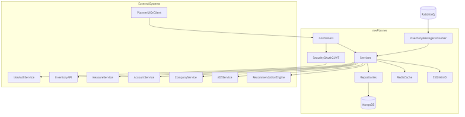
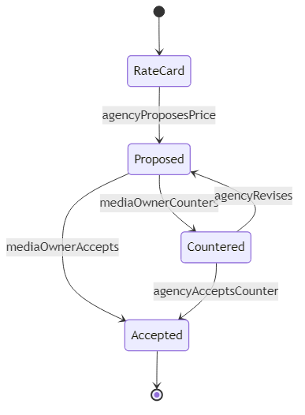
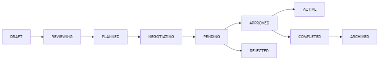
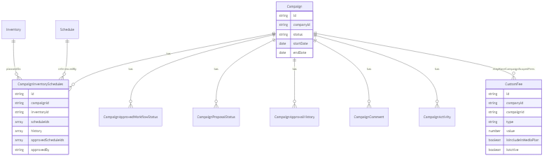

# MW Planner - Product Handover Documentation

## 1) Overview

`mw-planner` is the campaign planning and approval orchestration application. It manages campaign setup, inventory/schedule planning, pricing negotiations, approval workflows, and downstream submission integrations.

Core stack and runtime:
- Java 24, Spring Boot
- MongoDB as primary data store
- Redis for caching and idempotency support
- RabbitMQ consumers for inventory sync
- OAuth2 Resource Server (JWT) for API security
- S3-compatible object storage (MinIO/AWS S3) for assets

## 2) Developer Onboarding Guide

## 2.1 Prerequisites
- Java 24
- Docker + Docker Compose
- Gradle wrapper (`gradlew`)

## 2.2 Local Infrastructure Setup
From the repository root:

```bash
cd local-setup
docker compose up -d
```

Key local services:
- MongoDB: `localhost:27017`
- Redis: `localhost:6379`
- RabbitMQ: `localhost:5672`
- MinIO: `http://localhost:9000` (console `http://localhost:9001`)
- Prometheus: `http://localhost:9090`
- Grafana: `http://localhost:13000`

## 2.3 Run Application Locally
From repository root:

```bash
./gradlew clean build
./gradlew bootRun
```

Default app ports:
- API: `10000`
- Actuator: `8100`

## 2.4 Test and Quality Commands
```bash
./gradlew test
./gradlew integrationtest
./gradlew check
```

## 2.5 Configuration Notes
- Base config: `src/main/resources/application.yaml`
- Environment overrides: `application-mw-stg.yaml` and other profile files
- Service endpoints are grouped under `mw-planner.*` properties

## 3) GitLab Branching Strategy (Current)

Current release flow is standardized as:
- New feature/normal bugfix PRs: branch from `k8s/stg` and merge into `k8s/stg`
- QA sign-off promotion: merge `k8s/stg` into `k8s/prod`
- Hotfix PRs: raise directly against `k8s/prod`, then back-merge to `k8s/stg`


Branch discipline:
- Do: keep `k8s/stg` and `k8s/prod` synchronized after every production hotfix
- Do: treat `k8s/prod` as release-protected
- Do not: merge unreleased changes to `k8s/prod` without QA sign-off (except approved hotfixes)

## 4) Architecture and Integrations



## 5) Price Management Approval Flow

Price negotiation and approval is managed mainly through `price-management` endpoints and `CampaignInventorySchedules` history.



Approval and recalculation behavior:
- Any effective price change can reset impacted approvals
- Schedule-level approvals are tracked via `approvedScheduleIds` and `approvedBy`
- Pricing history captures transition actions: `RATE_CARD`, `PROPOSED`, `COUNTERED`, `ACCEPTED`
- Campaign status is moved to `NEGOTIATING` when renegotiation occurs

## 6) Campaign Status and Approval Workflow

Two connected mechanisms exist:
- Workflow approvals (`AGENCY -> INTERNAL -> MEDIA_OWNER`) in campaign approval workflow documents
- Time-driven lifecycle updates (`APPROVED -> ACTIVE -> COMPLETED -> ARCHIVED`) via scheduler



## 7) Custom Fee Logic

Custom fee model:
- Scope: company-level (`campaignId = null`) and campaign-level (`campaignId != null`)
- Types: `PERCENTAGE` and `VALUE`
- Visibility switch: `isIncludeInMediaPlan`
  - hidden fees affect media cost
  - visible fees are shown in media plan pricing

Fee calculation behavior in pricing services:
- Builds campaign fee context in batch (company + campaign fees)
- Splits fees into hidden and visible buckets
- Applies discounts/proposed pricing and re-applies visible fees where required
- Campaign-level fee mutations can trigger campaign approval reset

## 8) Technical Details

## 8.1 ERD (Conceptual Mongo Model)



## 8.2 Global Exception Handling and Custom Exceptions
- Global handler is centralized in `GlobalExceptionHandler`
- Domain exceptions extend `BaseException` with internal `ErrorCode` mapping
- Validation/auth/access/generic exceptions are transformed to uniform API error payloads

## 8.3 Internationalization (i18n)
- Message bundles under `src/main/resources/i18n/messages*.properties`
- Configured by `spring.messages.basename=i18n/messages`
- Responses can be localized through `MessageService`
- Supported language set includes `en` and `ja`

## 9) Known Gaps and Notes
- No dedicated ERD artifact exists in repository; diagram above is derived from domain models
- Pricing approval is embedded in schedule history instead of a separate workflow aggregate
- Some service branches still throw generic runtime exceptions and can be further normalized to domain exceptions

## 10) Pending Items (mw-planner)

1. Booking sync
2. Network inventory support: new schema, message consumer & listing and forecast calculations
3. Goal wise price display on inventory listing (CPM, CPS)
4. Completly remove inventory collection and use proxy calls to Inventory-api wherever inventory details needs to be displayed.
5. **Goal-based price calculation:** Support `performance.cpmRate` or `performance.cpsRate` on the campaign inventory filter API based on campaign `goalType`. See [Technical Document – Campaign inventory filter API (goal-based price)](TECHNICAL_DOCUMENT.md#3-campaign-inventory-filter-api-goal-based-price).

## 11) Primary Code References

- `src/main/resources/application.yaml`
- `src/main/java/com/mw/planner/controller/PriceManagementController.java`
- `src/main/java/com/mw/planner/controller/CampaignApprovalWorkflowController.java`
- `src/main/java/com/mw/planner/service/CampaignInventorySchedulesService.java`
- `src/main/java/com/mw/planner/service/CampaignApprovalWorkflowService.java`
- `src/main/java/com/mw/planner/service/CampaignStatusScheduler.java`
- `src/main/java/com/mw/planner/service/CustomFeeService.java`
- `src/main/java/com/mw/planner/exception/GlobalExceptionHandler.java`
