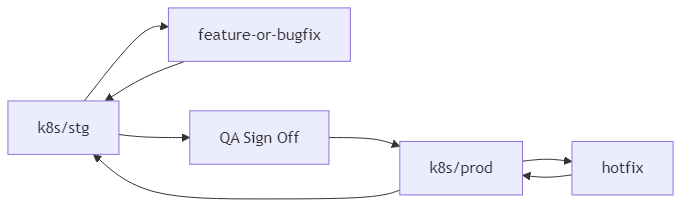
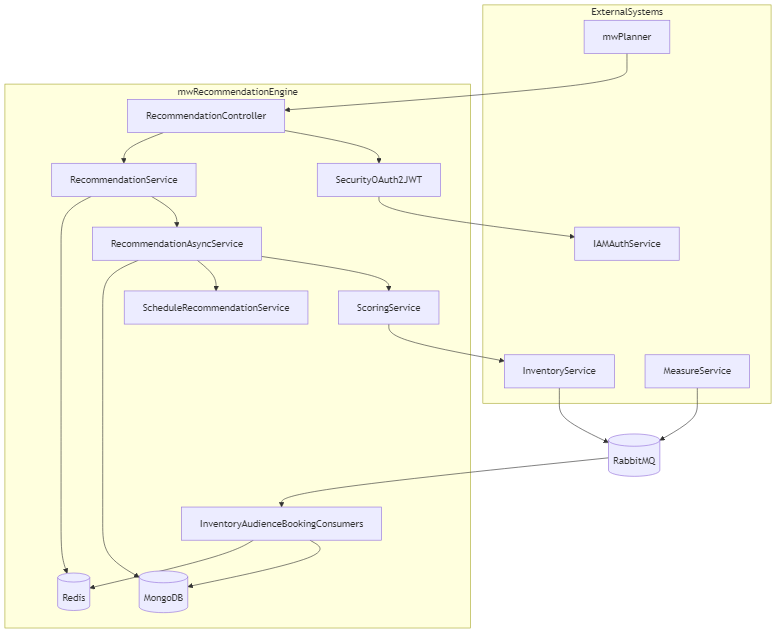
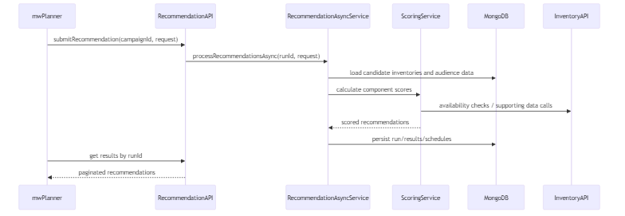
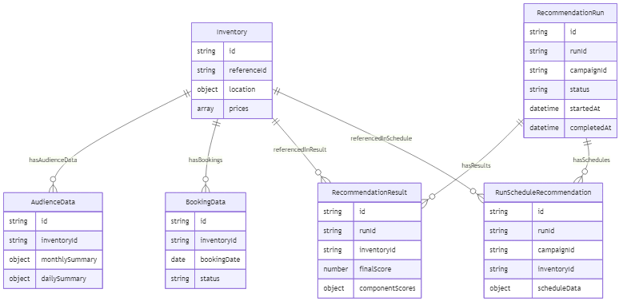

# MW Recommendation Engine - Product Handover Documentation

## 1) Overview

`mw-recommendation-engine` is a scoring and schedule recommendation microservice used by `mw-planner` to generate ranked inventory recommendations and schedule suggestions.

Core stack and runtime:
- Java 24, Spring Boot
- MongoDB for recommendation/audience/inventory/run data
- Redis for caching and consumer idempotency support
- RabbitMQ consumers for inventory/audience/booking synchronization
- OAuth2 Resource Server (JWT) for API security
- Async orchestration with virtual threads and `CompletableFuture`

Scope boundary:
- Price management approval flow and campaign approval/status flow are owned by `mw-planner`.

## 2) Developer Onboarding Guide

## 2.1 Prerequisites
- Java 24
- MongoDB
- Redis
- RabbitMQ
- Gradle wrapper (`gradlew`)

## 2.2 Local Runtime Expectations
Default local config expects:
- MongoDB: `localhost:27017` (`mw-recommendation-engine`)
- Redis: `localhost:6379`
- RabbitMQ: `localhost:5672`

These are configured in `src/main/resources/application.yaml`.

## 2.3 Run Application Locally
From repository root:

```bash
./gradlew clean build
./gradlew bootRun
```

Default app ports:
- API: `10002`
- Actuator: `8200`

## 2.4 Test and Quality Commands
```bash
./gradlew test
./gradlew integrationtest
./gradlew check
```

## 2.5 Primary APIs
- Submit recommendation request
- Fetch recommendation result pages
- Select or deselect inventories for run-level state

Main entrypoint: `RecommendationController`.

## 3) GitLab Branching Strategy (Current)

Current release flow is standardized as:
- New feature/normal bugfix PRs: branch from `k8s/stg` and merge into `k8s/stg`
- QA sign-off promotion: merge `k8s/stg` into `k8s/prod`
- Hotfix PRs: raise directly against `k8s/prod`, then back-merge to `k8s/stg`



Branch discipline:
- Do: keep `k8s/stg` and `k8s/prod` synchronized after every production hotfix
- Do: treat `k8s/prod` as release-protected
- Do not: merge unreleased changes to `k8s/prod` without QA sign-off (except approved hotfixes)

## 4) Architecture and Integrations



## 5) Data and Processing Flow



## 6) Custom Fee Logic

No dedicated custom fee domain module exists in `mw-recommendation-engine`.

Current pricing behavior in this service:
- Uses inventory pricing models (`cpm`, `spot`, `daily`, `weekly`, `monthly`) for cost estimation and scoring
- Performs budget-fit and schedule cost calculations

Custom fee ownership is expected upstream (primarily `mw-planner`) before recommendation request submission.

## 7) Technical Details

## 7.1 ERD (Conceptual Mongo Model)



## 7.2 Global Exception Handling and Custom Exceptions
- Global handler is centralized in `GlobalExceptionHandler`
- `BaseException` + `ErrorCode` are mapped to HTTP statuses
- Validation, auth, access, and generic exceptions return unified API envelopes

## 7.3 Internationalization (i18n)
- Message bundles under `src/main/resources/i18n/messages*.properties`
- Configured by `spring.messages.basename=i18n/messages`
- Localized error messages are resolved using Spring `MessageSource`

## 8) Pending Items (mw-recommendation-engine)

1. Load distribution across all pods on recommendation-engine for parallel async recommendation processing
2. Booking sync message consumer update with actual consumer config.
3. Network inventory support: new schema, message consumer & inventory + schedule recommendations
4. **Goal-based price calculation and costUnit:** Use CPM for Impression/Reach goals and CPS (spot) for other goals; add `costUnit` (CPM/CPS) to recommendation result cost object. When no goal is selected, keep current logic (spot priority, CPM fallback). See [Technical Document – Goal-based price and costUnit (pending)](TECHNICAL_DOCUMENT.md#35-goal-based-price-calculation-and-costunit-pending).

## 9) Primary Code References

- `src/main/resources/application.yaml`
- `src/main/java/com/mw/recommendation/engine/controller/RecommendationController.java`
- `src/main/java/com/mw/recommendation/engine/service/RecommendationService.java`
- `src/main/java/com/mw/recommendation/engine/service/RecommendationAsyncService.java`
- `src/main/java/com/mw/recommendation/engine/service/ScheduleRecommendationService.java`
- `src/main/java/com/mw/recommendation/engine/config/RabbitMQConfig.java`
- `src/main/java/com/mw/recommendation/engine/exception/GlobalExceptionHandler.java`
- `src/main/java/com/mw/recommendation/engine/domain/*`
