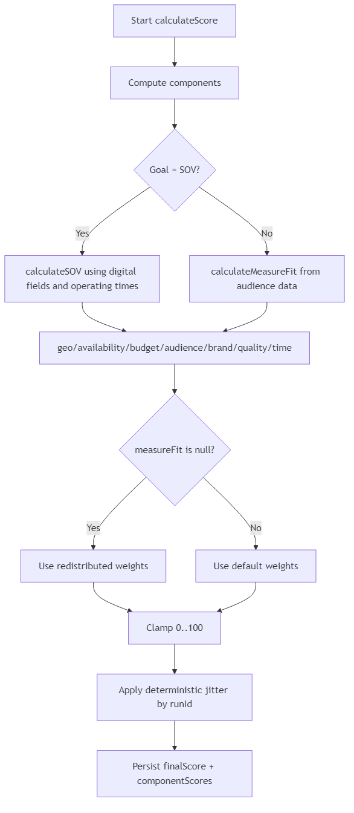
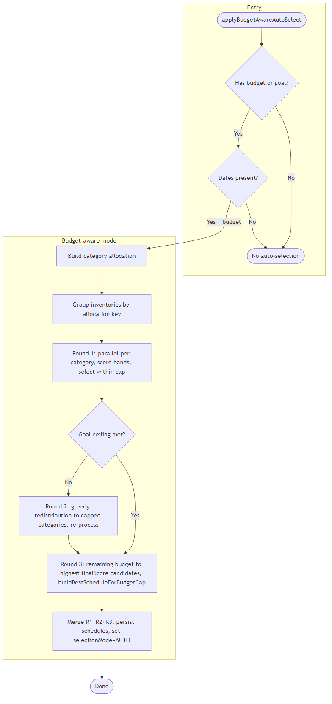
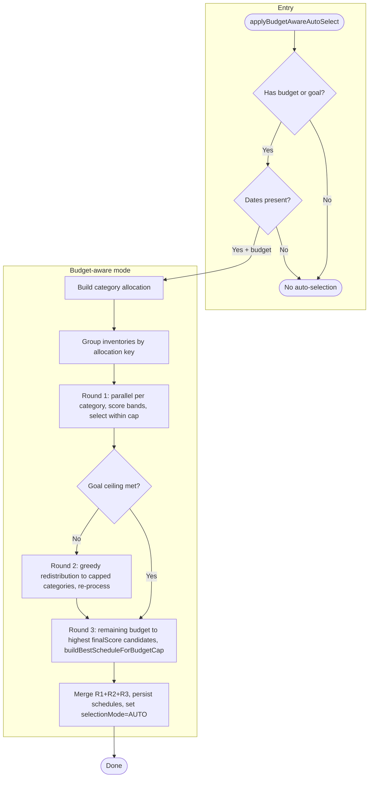
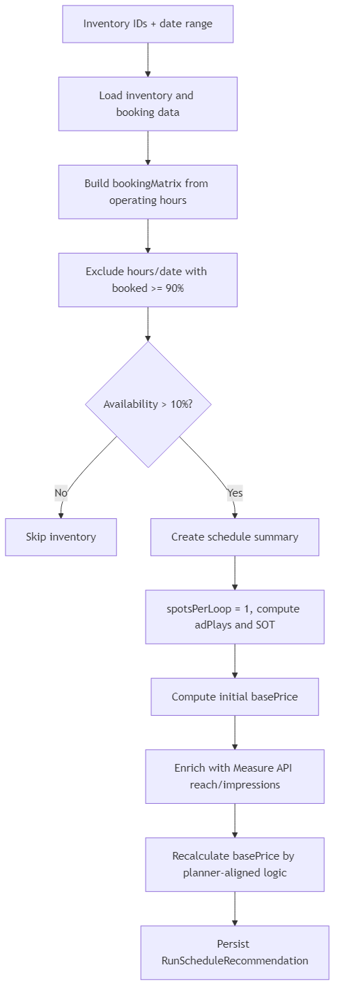
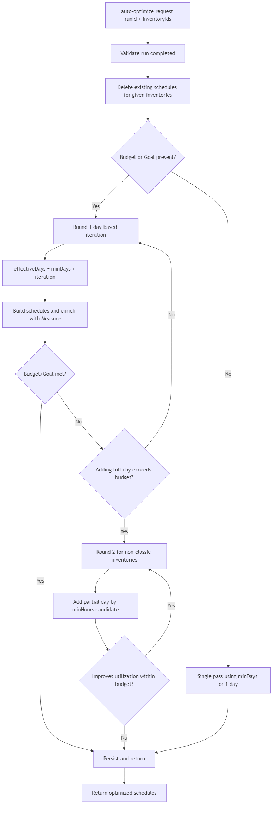

# MW Recommendation Engine - Technical Document

## Document Information
- Version: 2.1
- Status: Active
- Scope: Current implementation for scoring, auto inventory selection, schedule recommendation, and auto optimize schedules

---

## 1. Overview

`mw-recommendation-engine` generates inventory recommendations for campaigns, computes component scores, auto-selects inventories based on budget/goal logic, and persists schedule recommendations for planner sync.

Core flow:
1. Submit recommendation request (`runId` created or reused by request hash)
2. Async scoring and ranking of inventories
3. Budget/goal-aware auto-selection of inventories
4. Schedule generation and persistence per selected inventory
5. Optional auto-optimize schedules for selected inventory IDs

Primary classes:
- `RecommendationController`
- `RecommendationService`
- `RecommendationAsyncService`
- `ScoringServiceImpl`
- `ScheduleRecommendationService`

---

## 2. Scoring Engine (Current)

### 2.1 Components
Implemented in `ScoringServiceImpl` and persisted under `RecommendationResult.componentScores`:
- `measureFit`
- `geoFit`
- `availability`
- `budgetFit`
- `audienceFit`
- `brandFit`
- `qualityFit`
- `timeFit`

### 2.2 Weights
Default weights from `ScoringWeights`:
- measure: `0.20`
- geo: `0.20`
- availability: `0.10`
- budget: `0.20`
- audience: `0.10`
- brand: `0.10`
- quality: `0.06`
- time: `0.04`

When `measureFit` is null, redistributed weights are used:
- geo: `0.32`
- availability: `0.10`
- budget: `0.20`
- audience: `0.16`
- brand: `0.14`
- quality: `0.14`
- time: `0.04`

### 2.3 Notable implementation details
- `SOV` goal uses digital operational math (`loopDuration`, `spotsPerLoop`, `operatingTimes`) and country-level cached total possible ad plays.
- `geoFit` supports city/state matching plus geofence types (`Circle`, `Polygon`, `LineString`) with geodesic distance.
- `availability` differs by inventory type:
  - Digital: hourly booked percentage based averaging.
  - Classic: day-level booked percentage based averaging.
- `budgetFit` maps estimated cost/budget ratio to score buckets (`95/80/60/40/20`).
- `audienceFit` handles segments and demographics (age/gender/income/interests).
- Final score gets deterministic jitter via `VariationUtils.applyJitter(score, runId)`.

---

## 3. Auto Inventory Selection Logic

Implemented in `RecommendationAsyncService.applyBudgetAwareAutoSelect(...)`.

### 3.1 Trigger
Auto-selection runs after recommendation results are scored and saved.

### 3.2 Preconditions
- If neither budget nor goal exists: no auto-selection.
- If request dates missing: no auto-selection.
- Inventories with `finalScore <= 10` are not considered (`MIN_RECOMMENDATION_SCORE`).

### 3.3 Budget-aware mode (primary)
When budget is present:
1. Build category allocation from `BudgetAllocationUtils`.
2. Group inventories by allocation key.
3. Round 1 (parallel per category):
   - Process score bands in descending order: `>90, >80, ... >10`.
   - Build schedules in batches only for current band (reduces Measure API calls).
   - Select inventory if schedule `basePrice` fits remaining category cap.
4. Goal ceiling check across categories (`IMPRESSIONS`/`REACH`).
5. Round 2 greedy redistribution:
   - Unused budget from under-utilized categories is reassigned to capped categories.
   - Re-process categories in allocation-priority order.
6. Round 3 (remaining budget): After Round 1 and Round 2, any remaining total budget is allocated to the highest `finalScore` inventories not yet selected. For each candidate (in descending score order), the service calls `ScheduleRecommendationService.buildBestScheduleForBudgetCap(inv, startDate, endDate, remainingBudget, goal)`, which builds the best schedule that fits within remaining budget using: minDays first, then full days, then single hours (non-classic only). Selected schedules are merged with Round 1+2 selections.
7. Persist schedules for all selected inventories (R1 + R2 + R3) and set `selectionMode=AUTO`.

### 3.4 Goal-only mode (no budget)
When only goal exists:
- Process score bands globally.
- Build schedules per band.
- Add schedules while cumulative metric approaches goal (`IMPRESSIONS` or `REACH`).
- Set `selectionMode=AUTO` for selected inventories.

Diagram source: `docs/diagrams/auto_selection_flow.mmd`. Regenerate PNG with: `npx @mermaid-js/mermaid-cli -i docs/diagrams/auto_selection_flow.mmd -o docs/images/technical_document_auto_selection_flow.png`

### 3.5 Goal-based price calculation and costUnit (pending)

The following requirement describes how price calculation and the cost object can be aligned with campaign goal type. It is documented here for implementation; current code uses the existing priority (CPM when impressions available, then spot for Digital, then other models).

**Requirement:**

- **When `goalType` is Impression or Reach:** Price calculation for schedules and recommendation cost should be based on **CPM** (`price.cpm`), e.g. `(cpm/1000) * impressions`.
- **For all other goal options:** Price calculation should be based on **CPS** (cost per spot) using `price.spot`, e.g. `spot * adPlays`.
- **Cost object:** Add a **`costUnit`** field to the recommendation result cost object (e.g. `RecommendationResult.CostEstimate` and any API DTOs that expose cost). Values: `"CPM"` or `"CPS"` to indicate which unit was used for the displayed cost.
- **When no goal is selected:** Keep **current logic** (priority on spot/CPS when available, fallback to CPM when spot absent and impressions available). `costUnit` can be omitted or derived from which formula was used.

**Technical implementation pointers:**

- **Where to apply:** Schedule `basePrice` is computed in `ScheduleRecommendationService.calculateScheduleBasePrice()` and in enrichment (e.g. `enrichWithMeasureData()`); cost for result is in `RecommendationAsyncService.calculateCostEstimateForResult()` and equivalent in `RecommendationService.calculateCostEstimateForSelectedInventory()`. Pass `CampaignGoal goal` (from request) into these flows.
- **Logic:** If `goal == IMPRESSIONS || goal == REACH` → use CPM-based formula and set `costUnit = "CPM"`. Else (SOV, AD_PLAYS, CARBON, or null) → use spot-based formula where applicable and set `costUnit = "CPS"`. When no goal (null), retain existing priority (spot first, then CPM).
- **Schema:** Extend `RecommendationResult.CostEstimate` and API response cost DTOs (e.g. `RecommendationResponseDTO.CostEstimate`, `PaginatedRecommendationResponseDTO.CostEstimate`) with optional `String costUnit` (`"CPM"` | `"CPS"`).

---

## 4. Schedule Recommendation Logic

Implemented in `ScheduleRecommendationService`.

### 4.1 Schedule generation rules
- Uses inventory `operatingTimes` + `booking_data`.
- `BOOKED_THRESHOLD = 90%`:
  - Hours/dates with booked >= 90% are excluded.
- `MIN_AVAILABILITY_TO_RECOMMEND = 10%`:
  - Inventory is skipped if available operational share <= 10%.
- Recommended schedule uses:
  - `spotsPerLoop = 1`
  - `adPlays = loopsPerHour * spotsPerLoop * selectedHours`

### 4.2 Pricing and forecast enrichment
After base schedule matrix is built:
- Measure API (`MeasureApiClient.getReachAndFrequencyBySites`) enriches:
  - `estimatedImpressions`
  - `estimatedReach`
- `basePrice` is recalculated using planner-aligned logic:
  - `spot * adPlays`, or
  - `(cpm/1000) * impressions` when spot is absent

For future goal-based price selection (CPM vs CPS by goal type) and `costUnit` on the cost object, see §3.5.

### 4.3 Persistence model
Schedules are stored in `RunScheduleRecommendation` with:
- run/campaign identifiers
- booking matrix
- SOT fields
- ad plays
- base price + currency
- estimated impressions/reach

---

## 5. Auto Optimize Schedule Recommendation

Endpoint:
- `POST /api/v1/recommendation/schedules/runs/{runId}/auto-optimize`

Service:
- `ScheduleRecommendationService.autoOptimizeSchedules(runId, inventoryIds)`

### 5.1 Behavior
1. Validate run state (must be completed).
2. Delete existing schedules for provided inventory IDs.
3. Build optimized schedules using iterative rounds.

### 5.2 Round 1 (day-based growth)
- For each inventory, start from:
  - `sellingTerm.minDays` if present, otherwise `1 day`.
- Iteratively increase effective days (`minDays + iteration`) while:
  - budget/goal not met, and
  - more available days remain.
- Stops early when adding another full day would exceed budget.

### 5.3 Round 2 (hour-based refinement)
- Applied when budget exists and round 1 cannot add full days.
- For non-classic inventories, adds partial day by `sellingTerm.minHours`.
- Chooses the best next candidate that maximizes budget utilization without exceeding budget.
- Stops when no further progress or budget/goal achieved.

### 5.4 Constraints respected
- Operational windows per day
- 90% booking exclusion threshold
- Availability floor
- Budget and goal stopping conditions

---

## 6. API Surface (Relevant)

Recommendation:
- `POST /api/v1/recommendation/campaigns/{campaignId}/recommendations`
- `POST /api/v1/recommendation/runs/{runId}/results`
- `POST /api/v1/recommendation/runs/{runId}/selected-inventories`

Schedules:
- `GET /api/v1/recommendation/schedules/runs/{runId}`
- `POST /api/v1/recommendation/schedules/runs/{runId}/auto-optimize`

---

## 7. Data Objects (Core)

- `RecommendationRun`
  - status, completion, metadata, `autoSelectedInventoryIds`
- `RecommendationResult`
  - final score, component scores, forecast, cost (and pending `costUnit`; see §3.5), selection mode
- `RunScheduleRecommendation`
  - schedule matrix, plays, SOT, price, estimated reach/impressions

---

## 8. Notes and Current Behavior Guarantees

- Auto-selection is deterministic for a given `runId` + payload (jitter seed uses `runId`).
- Score-band batching is used to reduce expensive schedule/measure calls.
- Manual selection (`SELECT`) marks inventories as `MANUAL`; auto mode is preserved only for system-selected inventories.
- Schedule optimize focuses on feasible incremental coverage under budget/goal constraints instead of exhaustive search.
